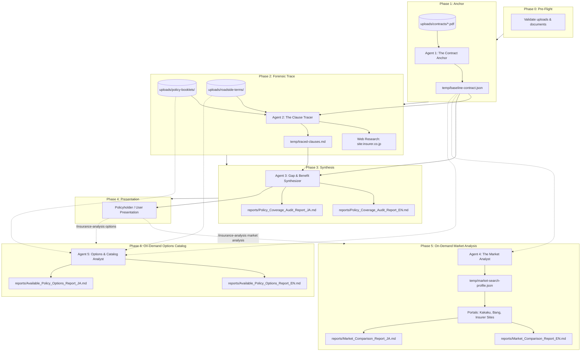

# 🛡️ Autonomous Auto Insurance Agent Swarm
### AI-Powered Forensic Contract Audit & Market Benchmarking for Japanese Auto Insurance

[](https://www.python.org/)
[](./AGENTS.md)
[](./workflow.md)
[-orange.svg)](./example-docs/)
[](./example-docs/)

---

## 📌 Overview

Automobile insurance contracts (*保険証券*) summarize coverage limits in a single page or digital snapshot. However, the legal reality, strict exclusions (*免責事項*), and hidden benefits are buried deep within multi-hundred-page policy booklets (*普通保険約款*) and roadside service regulations (*ロードサービス規約*).

Crucially, **policy booklets are versioned by date**. Different contractual terms apply depending on your exact policy inception date (*保険始期日*).

This autonomous multi-agent swarm:
1. **Reads and extracts** your primary auto insurance contract.
2. **Date-matches** the contract to the exact legally binding policy booklet and roadside regulations for that validity window.
3. **Forensically maps** every line item to granular clauses, PDF page numbers, and legal exclusions.
4. **Synthesizes dual-language audit reports (EN & JA)** highlighting critical danger zones (🔴🟡🟢) and usable perks.
5. **Benchmarks your policy on-demand** against top Japanese direct-sales competitors (apples-to-apples configuration).
6. **Catalogs all available policy options on-demand** (all 32 special provisions / 特約, roadside allowances, deductibles, discounts, and "Who Needs What?" recommendations).

> 💡 **Provider-Agnostic Design:** Works with **any Japanese insurer** (Mitsui Direct, Sony Sompo, SBI Sompo, Zurich, AXA Direct, Tokio Marine Nichido, Sompo Japan, Mitsui Sumitomo, Saison, etc.).

---

## 🏗️ Swarm Architecture

The system consists of **5 specialized AI agents** operating in sequential and on-demand phases:



### Agent Roles & Deliverables

| Agent | Role | Input | Output | Description |
|---|---|---|---|---|
| **Agent 1: Contract Anchor** | Baseline Extractor | `uploads/contracts/*.pdf` | `temp/baseline-contract.json` | Extracts inception date, vehicle specs, powertrain type (Hybrid/EV/ICE), active coverages, driver restrictions, and premium. |
| **Agent 2: Clause Tracer** | Legal Fine-Print Analyst | `baseline-contract.json` + `uploads/` | `temp/traced-clauses.md` | Executes date matching, deep-reads matched PDF booklets, tracks exact page/clause citations, and enriches with official web links. |
| **Agent 3: Gap Synthesizer** | Risk Advisor & Synthesizer | `baseline-contract.json` + `traced-clauses.md` | `reports/Policy_Coverage_Audit_Report_EN.md`<br>`reports/Policy_Coverage_Audit_Report_JA.md` | Produces executive audit reports featuring Danger Zones (🔴🟡🟢), 4-column roadside tables, and powertrain submersion risks. |
| **Agent 4: Market Analyst** | Competitive Benchmarking *(On-Demand)* | `baseline-contract.json` | `temp/market-search-profile.json`<br>`reports/Market_Comparison_Report_EN.md`<br>`reports/Market_Comparison_Report_JA.md` | Benchmarks your exact profile against the top 3 competitors for identical coverage parity, estimated premiums, and roadside differences. |
| **Agent 5: Options Analyst** | Policy Options & Rider Cataloger *(On-Demand)* | `baseline-contract.json` + `uploads/` | `reports/Available_Policy_Options_Report_EN.md`<br>`reports/Available_Policy_Options_Report_JA.md` | Compiles an exhaustive, easy-to-understand catalog of all available coverages, 32 special provisions (特約), roadside allowances, deductible options, and "Who Needs What?" recommendations. |

---

## 📂 Directory Structure & Conventions

```
insurance-agent/
├── .agents/
│   └── skills/
│       └── insurance-analysis/
│           └── SKILL.md              ← Antigravity skill definitions & command triggers
├── uploads/
│   ├── contracts/                    ← Place user insurance contract PDF here (git-ignored)
│   ├── policy-booklets/              ← Versioned general policy booklets (普通保険約款)
│   └── roadside-terms/               ← Standalone roadside assistance terms (if separate)
├── temp/                             ← Intermediate machine-readable working files (git-ignored)
│   ├── baseline-contract.json        ← Structured extraction from contract
│   ├── traced-clauses.md             ← Forensic clause mappings with page numbers
│   └── market-search-profile.json    ← Search parameters for market benchmarking
├── reports/                          ← Final human-readable audit & comparison reports (local/git-ignored)
│   ├── Policy_Coverage_Audit_Report_EN.md
│   ├── Policy_Coverage_Audit_Report_JA.md
│   ├── Market_Comparison_Report_EN.md
│   ├── Market_Comparison_Report_JA.md
│   ├── Available_Policy_Options_Report_EN.md
│   └── Available_Policy_Options_Report_JA.md
├── example-docs/                     ← Sanitized production-grade sample deliverables (tracked)
│   ├── Sample_Policy_Coverage_Audit_Report_EN.md
│   ├── Sample_Policy_Coverage_Audit_Report_JA.md
│   ├── Sample_Market_Comparison_Report_EN.md
│   ├── Sample_Market_Comparison_Report_JA.md
│   ├── Sample_Available_Policy_Options_Report_EN.md
│   ├── Sample_Available_Policy_Options_Report_JA.md
│   └── README.md
├── AGENTS.md                         ← Core swarm system prompts & agent instructions
├── workflow.md                       ← Step-by-step orchestrator execution pipeline
├── requirements.txt                  ← Python dependencies (PyMuPDF, PyPDF)
├── .gitignore                        ← Protects personal contracts and temp files
└── README.md
```

### Document Naming & Date Range Rules
Booklet filenames encode their validity period. The system extracts sequences (`YYYYMMDD` or `YYYYMM`) to match your contract inception date:
* `policywording_car_20250401_to_20260331.pdf` → Valid from `2025-04-01` to `2026-03-31`
* `roadservice_from_20250401.pdf` → Valid from `2025-04-01` to Present
* **Bundled Roadside Terms:** If your insurer (e.g. Tokio Marine, Sompo Japan) bundles roadside regulations directly inside the policy booklet, the agent seamlessly analyzes the booklet's internal roadside chapter.

---

## 🚀 Quick Start

### 1. Prerequisites & Installation

Ensure you have **Python 3.10+** installed:

```bash
# Clone the repository
git clone https://github.com/rajithst/insurance-policy-audit.git
cd insurance-policy-audit

# Create and activate virtual environment
python3 -m venv .venv
source .venv/bin/activate  # On Windows: .venv\Scripts\activate

# Install PDF processing libraries
pip install -r requirements.txt
```

### 2. Add Your Insurance Documents

1. Copy your auto insurance contract or policy certificate PDF into:
   ```bash
   uploads/contracts/my_insurance_policy.pdf
   ```
2. Ensure the corresponding policy booklet(s) are placed in:
   ```bash
   uploads/policy-booklets/
   uploads/roadside-terms/      # Optional if bundled inside the policy booklet
   ```

---

## 💻 How to Use

The agent swarm is orchestrated through the **`insurance-analysis` skill** in Antigravity IDE or CLI.

### Command 1: Run the Full Contract Audit

Run the primary 3-agent pipeline (extract baseline, date-match booklet, trace exclusions, generate dual-language audit reports):

```text
/insurance-analysis
```

*Alternative natural language triggers:*
- *"run insurance analysis"*
- *"analyze my contract"*
- *"check my coverage"*
- *"audit my policy"*

#### What You Get:
* 📄 Generated in `reports/`:
  - [`Policy_Coverage_Audit_Report_EN.md`](./reports/Policy_Coverage_Audit_Report_EN.md) (Comprehensive English Report)
  - [`Policy_Coverage_Audit_Report_JA.md`](./reports/Policy_Coverage_Audit_Report_JA.md) (Comprehensive Japanese Report)
* 🌟 **View Sample Output:** [`example-docs/Sample_Policy_Coverage_Audit_Report_EN.md`](./example-docs/Sample_Policy_Coverage_Audit_Report_EN.md) | [`JA`](./example-docs/Sample_Policy_Coverage_Audit_Report_JA.md)
* 🔴 **The Danger Zone:** Severity-classified breakdown of what is NOT covered (e.g., lack of vehicle hull insurance, driver scope breach, earthquake exclusions).
* 🎁 **Hidden Usable Benefits:** Structured 4-column tables for 24/7 Roadside Assistance and Stranded Travel Protection (towing distance, emergency hotel, rental car rules, first-call reimbursement mandate).
* ⚡ **Powertrain Analysis:** Specific high-voltage traction battery submersion risks and out-of-charge (*電欠*) towing rules for Hybrid/EV vehicles.

---

### Command 2: Run On-Demand Market Benchmarking

Benchmark your existing contract against the Japanese direct-sales insurance market (comparing with top providers like SBI Sompo, Sony Sompo, Zurich, Mitsui Direct, etc.):

```text
/insurance-analysis market analysis
```

*Alternative natural language triggers:*
- *"compare insurers"*
- *"benchmark my premium"*
- *"find cheaper insurance"*
- *"competitive quotes"*
- *"shopping around"*

#### What You Get:
* 📄 Generated in `reports/`:
  - [`Market_Comparison_Report_EN.md`](./reports/Market_Comparison_Report_EN.md) (English Comparison Report)
  - [`Market_Comparison_Report_JA.md`](./reports/Market_Comparison_Report_JA.md) (Japanese Comparison Report)
* 🌟 **View Sample Output:** [`example-docs/Sample_Market_Comparison_Report_EN.md`](./example-docs/Sample_Market_Comparison_Report_EN.md) | [`JA`](./example-docs/Sample_Market_Comparison_Report_JA.md)
* 📊 **Master Comparison Table:** Side-by-side benchmarking of your current insurer vs. 3 competitors with identical coverage limits.
* 💰 **Estimated Price Spreads:** Estimated net annual savings and discount breakdowns (early renewal, online application, paperless).
* 🚗 **Roadside Assistance Comparison:** Towing distance allowances, hotel caps, rental car gates, and cancellation fee coverage.
* 🔄 **Switching Action Plan:** Non-fleet grade portability (*等級引継ぎ*), short-term rate table warning (*短期率* vs. *月割*), and step-by-step renewal switching guide.

---

### Command 3: Run On-Demand Policy Options & Endorsement Catalog

Generate an exhaustive, plain-language catalog of every available policy option, rider (*特約*), deductible tier, roadside benefit, and buyer recommendation directly from the insurer's legally binding booklets:

```text
/insurance-analysis options
```

*Alternative natural language triggers:*
- *"what options are available"*
- *"list all available options"*
- *"show available riders"*
- *"coverage catalog"*
- *"options report"*

#### What You Get:
* 📄 Generated in `reports/`:
  - [`Available_Policy_Options_Report_EN.md`](./reports/Available_Policy_Options_Report_EN.md) (Comprehensive English Options Catalog)
  - [`Available_Policy_Options_Report_JA.md`](./reports/Available_Policy_Options_Report_JA.md) (Comprehensive Japanese Options Catalog)
* 🌟 **View Sample Output:** [`example-docs/Sample_Available_Policy_Options_Report_EN.md`](./example-docs/Sample_Available_Policy_Options_Report_EN.md) | [`JA`](./example-docs/Sample_Available_Policy_Options_Report_JA.md)
* 📋 **The Master 32 Special Provisions Catalog:** Complete breakdown of all 32 endorsements (*特約 1–32*), organized into 7 logical groups (Liability, Injury, Vehicle Hull, Family/Lifestyle, Driver Scope, Billing/Admin, Telematics Dashcam).
* 🏷️ **Status Flags:** Clear tagging for every item: **[ACTIVE ✅]**, **[AVAILABLE TO ADD ➕]**, or **[MANDATORY BUNDLED 🔹]**.
* 🎯 **"Who Needs What?" Recommendation Matrix:** Persona-based guides for Families with Kids, High-Tech Hybrid/EV Owners, Bicycle Commuters, Road-Trippers, and Budget Optimizers.
* 📝 **Step-by-Step Mid-Term Addition Guide:** Exact click-by-click instructions for modifying or adding endorsements mid-term via the insurer's Customer My Page.

---

## 🛡️ Privacy & Confidentiality

Insurance certificates contain sensitive personal data (names, home addresses, license plate numbers, chassis numbers). 

- **Local Execution:** All extraction, document matching, and synthesis run directly inside your workspace.
- **Git-Ignored Personal Files:** The [`.gitignore`](./.gitignore) explicitly ignores:
  - `uploads/contracts/*` (prevents private policy PDFs from ever being committed).
  - `temp/*` (intermediate JSON/markdown files containing extracted personal data).
- **Public Reference Materials:** Only generic policy booklets and roadside terms are tracked in version control.

---

## ⚖️ Legal Disclaimer

*This software is an autonomous AI analysis tool provided for informational and comparative purposes only. It does not constitute certified legal advice, financial advice, or an insurance brokerage service. Coverage eligibility and claim determinations are governed solely by the underwriting insurance company's binding policy wording and official underwriting guidelines. Always consult your insurance carrier or a licensed insurance professional before modifying coverage or switching providers.*

---

## 📜 License

Distributed under the MIT License. See `LICENSE` for more information.
