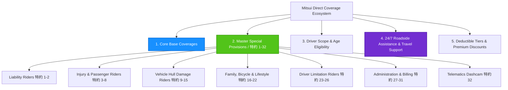

# Automobile Insurance Available Policy Options & Endorsement Catalog
## Comprehensive Guide to All Available Coverages, Riders (特約 1–32), and Benefits

> **Underwriting Insurer:** Mitsui Direct General Insurance Co., Ltd. (三井ダイレクト損害保険株式会社)  
> **Audited Policy Booklet:** [`uploads/policy-booklets/policywording_car_20250401_to_20260331.pdf`](../uploads/policy-booklets/policywording_car_20250401_to_20260331.pdf) (Valid: April 1, 2025 – March 31, 2026)  
> **Audited Roadside Terms:** [`uploads/roadside-terms/roadservice_from_20250401.pdf`](../uploads/roadside-terms/roadservice_from_20250401.pdf) (Valid: April 1, 2025 – Present)  
> **Active Policy Reference:** Policy #POL-SAMPLE-202501 (Nissan X-Trail SNT33 e-POWER / e-4ORCE)  
> **Catalog Report Date:** September 21, 2026  

---

## Executive Summary

Automobile insurance contracts summarize only the coverages you explicitly opted into upon enrollment. However, Japanese general insurance policy wordings (*普通保険約款*) contain an extensive catalog of optional protections, specialty endorsements (*特約*), deductible adjustments, and mobility perks that can be added or modified at any time or during annual renewal.

This catalog report provides a complete, granular inventory of **every option available from Mitsui Direct General Insurance**, citing exact PDF page numbers, formal article clauses, current contract status (**[ACTIVE ✅]**, **[AVAILABLE TO ADD ➕]**, or **[MANDATORY BUNDLED 🔹]**), and tailored guidance on **who needs each option**.



---

## Table of Contents
1. [Section 1: Core Base Coverages (基本補償)](#section-1-core-base-coverages-基本補償)
2. [Section 2: The Master 32 Special Provisions Catalog (特約一覧)](#section-2-the-master-32-special-provisions-catalog-特約一覧)
   - [2.1 Liability Riders (賠償に関する特約)](#21-liability-riders-賠償に関する特約)
   - [2.2 Injury & Passenger Protection Riders (傷害に関する特約)](#22-injury--passenger-protection-riders-傷害に関する特約)
   - [2.3 Vehicle Hull Damage Riders (車両に関する特約)](#23-vehicle-hull-damage-riders-車両に関する特約)
   - [2.4 Family, Bicycle & Everyday Lifestyle Riders (その他補償・ファミリー特約)](#24-family-bicycle--everyday-lifestyle-riders-その他補償ファミリー特約)
   - [2.5 Driver Scope & Age Condition Riders (運転者限定・年齢条件)](#25-driver-scope--age-condition-riders-運転者限定年齢条件)
   - [2.6 Contract Administration & Billing Riders (手続・保険料特約)](#26-contract-administration--billing-riders-手続保険料特約)
   - [2.7 Connected Telematics Dashcam Rider (テレマティクス・ドラレコ特約)](#27-connected-telematics-dashcam-rider-テレマティクスドラレコ特約)
3. [Section 3: Roadside Assistance & Stranded Travel Support](#section-3-roadside-assistance--stranded-travel-support)
4. [Section 4: Deductible Structures & Available Discounts](#section-4-deductible-structures--available-discounts)
5. [Section 5: Strategic "Who Needs What?" Recommendation Guide](#section-5-strategic-who-needs-what-recommendation-guide)
6. [Section 6: How to Add or Modify Coverage Mid-Term](#section-6-how-to-add-or-modify-coverage-mid-term)

---

## Section 1: Core Base Coverages (基本補償)

These constitute the foundational chapters of the General Policy Booklet (*普通保険約款*):

| Coverage Line | Available Options & Limits | Current Policy Status | Legal Reference | Key Explanation |
|---|---|---|---|---|
| **Third-Party Bodily Injury Liability**<br>*(対人賠償保険)* | • **無制限 (Unlimited)** *(Standard / Recommended)*<br>• Custom limits (e.g., ¥100M, ¥200M) | **[ACTIVE ✅]**<br>Limit: Unlimited | Chapter 1 (第1章)<br>Articles 2, 4, 11<br>📑 **Pages 13–15** | Covers statutory civil liability exceeding Compulsory Automobile Liability Insurance (CALI / 自賠責保険) for injuring or killing third parties. Includes ¥100,000–¥200,000 condolence temporary expense (*弔慰金等の臨時費用*). |
| **Third-Party Property Damage Liability**<br>*(対物賠償保険)* | • **無制限 (Unlimited)** *(Standard / Recommended)*<br>• Custom limits (e.g., ¥10M, ¥20M, ¥50M) | **[ACTIVE ✅]**<br>Limit: Unlimited | Chapter 2 (第2章)<br>Articles 2, 4, 11<br>📑 **Pages 15–16** | Covers statutory liability for destroying third-party vehicles, buildings, guardrails, utility poles, or causing railroad railway disruptions. Payout capped at market value (*時価額*). |
| **Personal Injury Protection**<br>*(人身傷害保険)* | • **Limits:** ¥30M, ¥50M, ¥70M, ¥100M, Unlimited<br>• **Scope Choice A:** In-Vehicle & Out-of-Vehicle (*車内・車外補償* with 特約3)<br>• **Scope Choice B:** In-Vehicle Only (*車内のみ補償*) | **[ACTIVE ✅]**<br>Limit: ¥30,000,000<br>(In & Out of car) | Chapter 3 (第3章)<br>Articles 2, 3, 4, Schedule<br>📑 **Pages 16–18** | Compensates actual financial damages (medical expenses, lost wages, pain & suffering) for you and family members regardless of fault percentage. |
| **Vehicle Hull Damage Insurance**<br>*(車両保険)* | • **一般タイプ (Comprehensive):** All collisions, single-car crashes, theft, fire, typhoons, floods, vandalism.<br>• **限定タイプ (Economy / 車対車＋限定危険):** Car-to-car collisions + natural hazards (excludes single-car accidents & hit-and-run).<br>• **未加入 (None / なし):** Zero coverage. | ❌ **[AVAILABLE TO ADD ➕]**<br>*(Currently: NONE)* | Chapter 4 (第4章)<br>Articles 2, 4, 5<br>📑 **Pages 18–19** | Covers physical repair or total loss of the insured car. For a ¥4M+ vehicle with underfloor lithium-ion batteries and dual motors, highly recommended to avoid total financial loss upon submersion or collision. |

---

## Section 2: The Master 32 Special Provisions Catalog (特約一覧)

The policy booklet provides exactly **32 numbered Special Provisions (*特約*)** listed in the Master Special Provisions Table (*＜特約一覧＞*, Page 68):

```
┌────────────────────────────────────────────────────────────────────────────────────────┐
│                        MASTER SPECIAL PROVISIONS (特約一覧)                            │
├────────────────────┬────────────────────────────────────┬──────────┬───────────────────┤
│ Rider Number       │ Formal Rider Name                  │ Booklet  │ Status on Policy  │
├────────────────────┼────────────────────────────────────┼──────────┼───────────────────┤
│ 特約 (1)           │ 対物超過修理費用補償特約           │ Page 32  │ [ACTIVE ✅]       │
│ 特約 (2)           │ 被害者救済費用特約 (不正アクセス等)│ Page 33  │ [AUTO BUNDLED 🔹] │
│ 特約 (3)           │ 自動車事故特約 (人身傷害車外拡張)  │ Page 34  │ [ACTIVE ✅]       │
│ 特約 (4)           │ 自損事故傷害特約                   │ Page 35  │ [AVAILABLE ➕]    │
│ 特約 (5)           │ 無保険車傷害特約                   │ Page 37  │ [AVAILABLE ➕]    │
│ 特約 (6)           │ 搭乗者傷害特約（傷害一時金払）     │ Page 39  │ [AVAILABLE ➕]    │
│ 特約 (7)           │ 搭乗者傷害特約（死亡・後遺障害）   │ Page 40  │ [ACTIVE ✅]       │
│ 特約 (8)           │ 搭傷医療倍額支払特約               │ Page 41  │ [AVAILABLE ➕]    │
│ 特約 (9)           │ 新車特約                           │ Page 41  │ [AVAILABLE ➕]    │
│ 特約 (10)          │ 車両全損時復旧費用補償特約         │ Page 42  │ [AVAILABLE ➕]    │
│ 特約 (11)          │ 車両保険無過失事故特約             │ Page 43  │ [AVAILABLE ➕]    │
│ 特約 (12)          │ 車両危険限定補償特約 (限定タイプ)  │ Page 44  │ [AVAILABLE ➕]    │
│ 特約 (13)          │ 車両保険免責金額特約 (免責ゼロ等)  │ Page 44  │ [AVAILABLE ➕]    │
│ 特約 (14)          │ 身の回り品補償特約                 │ Page 45  │ [AVAILABLE ➕]    │
│ 特約 (15)          │ レンタカー費用補償特約（実損払）   │ Page 46  │ [AVAILABLE ➕]    │
│ 特約 (16)          │ 他車運転危険補償特約               │ Page 48  │ [AUTO BUNDLED 🔹] │
│ 特約 (17)          │ ファミリーバイク特約（賠償損害）   │ Page 49  │ [AVAILABLE ➕]    │
│ 特約 (18)          │ ファミリーバイク特約（自損傷害型） │ Page 49  │ [AVAILABLE ➕]    │
│ 特約 (19)          │ ファミリーバイク特約（人身傷害型） │ Page 50  │ [AVAILABLE ➕]    │
│ 特約 (20)          │ 自転車・車いす・ベビーカー等定額特約│ Page 51  │ [AVAILABLE ➕]    │
│ 特約 (21)          │ 自動車事故弁護士費用等補償特約     │ Page 53  │ [ACTIVE ✅]       │
│ 特約 (22)          │ 日常生活賠償責任補償特約           │ Page 56  │ [AVAILABLE ➕]    │
│ 特約 (23)          │ 運転者家族限定特約                 │ Page 58  │ [AVAILABLE ➕]    │
│ 特約 (24)          │ 運転者本人・配偶者限定特約         │ Page 58  │ [AVAILABLE ➕]    │
│ 特約 (25)          │ 運転者本人限定特約                 │ Page 59  │ [ACTIVE ✅]       │
│ 特約 (26)          │ 運転者年齢限定特約 (21/26/35歳)    │ Page 59  │ [ACTIVE ✅]       │
│ 特約 (27)          │ 保険証券不発行特約 (ｅサービス)    │ Page 60  │ [ACTIVE ✅]       │
│ 特約 (28)          │ スマート継続手続特約               │ Page 60  │ [AUTO BUNDLED 🔹] │
│ 特約 (29)          │ 保険料分割払特約                   │ Page 61  │ [AVAILABLE ➕]    │
│ 特約 (30)          │ 分割払追加保険料特約               │ Page 62  │ [AVAILABLE ➕]    │
│ 特約 (31)          │ クレジットカード払込特約           │ Page 63  │ [ACTIVE ✅]       │
│ 特約 (32)          │ ドライブレコーダー事故通知特約     │ Page 64  │ [AVAILABLE ➕]    │
└────────────────────┴────────────────────────────────────┴──────────┴───────────────────┘
```

---

### 2.1 Liability Riders (賠償に関する特約)

#### (1) Excess Property Damage Repair Cost Rider *(対物超過修理費用補償特約)*
- **Status:** **[ACTIVE ✅]** (Limit: ¥500,000)
- **Booklet Reference:** Special Provision (1), 📑 **Pages 32–33**, Articles 2, 3, 6.
- **Coverage:** If the repair cost of the third party's vehicle exceeds its market cash value (*時価額*), pays your fault-share of the excess repairs up to **¥500,000**.
- **Important Condition:** Requires actual repairs completed within **6 months** of the accident date. Scrap/replacement pays ¥0.

#### (2) Victim Relief Expense Rider for Cyber Attack & Vehicle Defects *(不正アクセス・車両の欠陥等による事故の被害者救済費用特約)*
- **Status:** **[MANDATORY BUNDLED 🔹]**
- **Booklet Reference:** Special Provision (2), 📑 **Pages 33–34**, Articles 2, 3, 5.
- **Coverage:** If your vehicle causes an accident due to an unauthorized remote cyber hack or an unpreventable manufacturing defect where you have zero negligence, pays damages to innocent victims so they are never left without compensation.

---

### 2.2 Injury & Passenger Protection Riders (傷害に関する特約)

#### (3) Automobile Accident Extension Rider *(自動車事故特約)*
- **Status:** **[ACTIVE ✅]**
- **Booklet Reference:** Special Provision (3), 📑 **Pages 34–35**, Articles 2, 3.
- **Coverage:** Broadens Personal Injury Protection so you and your cohabiting family are covered not only in your own car, but also when walking, riding bicycles, or riding as a passenger in friends' cars, taxis, or buses.

#### (4) Self-Inflicted Accident Injury Rider *(自損事故傷害特約)*
- **Status:** **[AVAILABLE TO ADD ➕]**
- **Booklet Reference:** Special Provision (4), 📑 **Pages 35–37**, Articles 2, 3, 6.
- **Coverage:** Pays fixed compensation (¥15M death benefit, hospital daily allowances) for single-vehicle crashes where CALI does not pay (primarily used when Personal Injury Protection is not selected).

#### (5) Uninsured Motorist Injury Rider *(無保険車傷害特約)*
- **Status:** **[AVAILABLE TO ADD ➕]**
- **Booklet Reference:** Special Provision (5), 📑 **Pages 37–39**, Articles 2, 3, 6.
- **Coverage:** Pays up to **¥200,000,000** per person for death or permanent disability if struck by an uninsured vehicle or an unidentified hit-and-run driver.

#### (6) Passenger Injury Lump-Sum Rider *(搭乗者傷害危険補償特約 傷害一時金払)*
- **Status:** **[AVAILABLE TO ADD ➕]**
- **Booklet Reference:** Special Provision (6), 📑 **Pages 39–40**, Articles 2, 3, 6.
- **Coverage:** Pays an immediate fixed lump sum (typically **¥100,000**) if a passenger is injured and requires 4 or 5+ days of treatment/hospitalization. Enables quick pocket cash without waiting for formal medical settlement.

#### (7) Passenger Injury Death & Disability Rider *(搭乗者傷害危険補償特約 死亡・後遺障害)*
- **Status:** **[ACTIVE ✅]** (Limit: ¥3,000,000)
- **Booklet Reference:** Special Provision (7), 📑 **Pages 40–41**, Articles 2, 3, 6, 7.
- **Coverage:** Pays a fixed lump-sum benefit of **¥3,000,000** for death or 4%–100% (¥120k–¥3M) for permanent disability resulting from an accident within 180 days, stacked on top of Personal Injury Protection.

#### (8) Double Medical Benefit Passenger Injury Rider *(搭乗者傷害の医療保険金倍額支払に関する特約)*
- **Status:** **[AVAILABLE TO ADD ➕]**
- **Booklet Reference:** Special Provision (8), 📑 **Page 41**, Articles 2, 3.
- **Coverage:** Automatically doubles the medical benefit payout under Passenger Injury Protection if the victim was properly wearing a seatbelt at the time of the collision.

---

### 2.3 Vehicle Hull Damage Riders (車両に関する特約)

*(Note: These riders require the attachment of underlying Vehicle Hull Insurance).*

#### (9) New Vehicle Replacement Rider *(新車特約)*
- **Status:** **[AVAILABLE TO ADD ➕]**
- **Booklet Reference:** Special Provision (9), 📑 **Pages 41–42**, Articles 2, 3, 6.
- **Coverage:** If accident damage to a new vehicle equals or exceeds **50% of the insured value** (or cabin frame structural damage), pays the full original replacement value to purchase a brand new car, plus up to ¥200,000 acquisition fee support. Applicable for vehicles within 1–3 years of initial registration.

#### (10) Total Loss Repair / Replacement Expense Rider *(車両全損時復旧費用補償特約)*
- **Status:** **[AVAILABLE TO ADD ➕]**
- **Booklet Reference:** Special Provision (10), 📑 **Pages 42–43**, Articles 2, 3, 6.
- **Coverage:** For older vehicles with low market cash value, pays an additional agreed amount (up to **¥500,000**) above the market cap if actual repair costs exceed the cash value total loss ceiling.

#### (11) No-Fault Vehicle Accident Rating Protection Rider *(車両保険無過失事故特約)*
- **Status:** **[AVAILABLE TO ADD ➕]** (Bundled automatically with Vehicle Insurance)
- **Booklet Reference:** Special Provision (11), 📑 **Pages 43–44**, Articles 2, 3.
- **Coverage:** If your car is hit in a 100% zero-fault accident (e.g. struck from behind while stopped at a red light by an identified driver), claiming against your vehicle insurance **does NOT trigger a 3-grade penalty** upon renewal.

#### (12) Limited Vehicle Hazard Rider *(車両危険限定補償特約 / 「限定タイプ」)*
- **Status:** **[AVAILABLE TO ADD ➕]**
- **Booklet Reference:** Special Provision (12), 📑 **Page 44**, Articles 2, 3.
- **Coverage:** Converts Comprehensive Vehicle Hull into "Economy Type" (*車対車＋限定危険*). Covers vehicle collisions with identified vehicles, fire, theft, typhoons, floods, and falling objects, while excluding single-car crashes and hit-and-runs to lower premiums by 30–50%.

#### (13) Vehicle Deductible Options Rider *(車両保険の免責金額に関する特約)*
- **Status:** **[AVAILABLE TO ADD ➕]**
- **Booklet Reference:** Special Provision (13), 📑 **Pages 44–45**, Articles 2, 3.
- **Coverage:** Modifies deductible out-of-pocket amounts:
  - **車対車免責ゼロ特約:** Deductible is **¥0** on the 1st car-to-car accident, and **¥100,000** on subsequent accidents.
  - Other selectable structures: 5-10万円, 10-10万円, or 10万円定額.

#### (14) In-Vehicle Personal Belongings Rider *(身の回り品補償特約)*
- **Status:** **[AVAILABLE TO ADD ➕]**
- **Booklet Reference:** Special Provision (14), 📑 **Pages 45–46**, Articles 2, 3, 6.
- **Coverage:** Reimburses up to **¥100,000–¥300,000** (¥5,000 deductible) for personal items damaged or stolen while carried inside or mounted on the insured car (e.g., laptops, smartphones, golf sets, cameras, sports gear, clothing).

#### (15) Rental Car Expense Coverage Rider *(レンタカー費用補償特約 実損払)*
- **Status:** **[AVAILABLE TO ADD ➕]**
- **Booklet Reference:** Special Provision (15), 📑 **Pages 46–48**, Articles 2, 3, 6.
- **Coverage:** Reimburses actual daily rental car charges while the insured vehicle is undergoing accident repairs (selectable limits: **¥5,000, ¥7,000, or ¥10,000 per day**, up to a maximum of 30 days).

---

### 2.4 Family, Bicycle & Everyday Lifestyle Riders (その他補償・ファミリー特約)

#### (16) Driving Other Cars Rider *(他車運転危険補償特約)*
- **Status:** **[MANDATORY BUNDLED 🔹]**
- **Booklet Reference:** Special Provision (16), 📑 **Pages 48–49**, Articles 2, 3, 4.
- **Coverage:** Automatically included for private passenger cars. Treats temporarily borrowed private passenger cars as the insured vehicle under your Bodily Injury, Property Damage, and Personal Injury coverages. *(Note: Borrowed vehicle hull damage is linked to your own vehicle hull insurance status).*

#### (17) Family Motorbike Rider - Liability Only *(ファミリーバイク特約 賠償損害)*
- **Status:** **[AVAILABLE TO ADD ➕]**
- **Booklet Reference:** Special Provision (17), 📑 **Pages 49–50**, Articles 2, 3.
- **Coverage:** Covers accidents while riding a **125cc or under motorized scooter / motorbike** (owned or borrowed by you or your family) for third-party bodily injury and property damage liability. Claims do **not** affect your auto policy's NCD grade.

#### (18) Family Motorbike Rider - Liability + Self-Inflicted Injury *(ファミリーバイク特約 賠償損害・自損傷害)*
- **Status:** **[AVAILABLE TO ADD ➕]**
- **Booklet Reference:** Special Provision (18), 📑 **Pages 49–50**, Articles 2, 3.
- **Coverage:** Extends scooter coverage to include rider death or injury in single-vehicle crashes (¥15M death benefit).

#### (19) Family Motorbike Rider - Liability + Personal Injury *(ファミリーバイク特約 賠償損害・人身傷害)*
- **Status:** **[AVAILABLE TO ADD ➕]**
- **Booklet Reference:** Special Provision (19), 📑 **Pages 50–51**, Articles 2, 3.
- **Coverage:** Offers full actual damage compensation (medical costs, lost wages, pain & suffering) for scooter riding using Personal Injury standards, regardless of fault.

#### (20) Bicycle, Wheelchair, Stroller & Senior Car Rider *(自転車・車いす・ベビーカー・シニアカー事故傷害定額払特約)*
- **Status:** **[AVAILABLE TO ADD ➕]**
- **Booklet Reference:** Special Provision (20), 📑 **Pages 51–53**, Articles 2, 3, 6.
- **Coverage:** Pays fixed payouts for injuries suffered while operating or being struck by a bicycle, baby stroller, wheelchair, or electric mobility scooter:
  - Death: **¥3,000,000**
  - Disability: Graded based on severity schedule
  - Hospital stay: ¥10,000 (1–4 days) or schedule payment (5+ days)

#### (21) Attorney Fee & Legal Expense Rider *(自動車事故弁護士費用等補償特約)*
- **Status:** **[ACTIVE ✅]** (Limit: ¥3,000,000)
- **Booklet Reference:** Special Provision (21), 📑 **Pages 53–56**, Articles 2, 3, 5, 7.
- **Coverage:** Up to **¥3,000,000** for legal retainers, court costs, and lawyer fees, plus up to **¥100,000** for pre-litigation legal consultations when pursuing claims in zero-fault accidents (*もらい事故*). Claims do not penalize your NCD grade.

#### (22) Personal / Everyday Life Liability Rider *(日常生活賠償責任補償特約)*
- **Status:** **[AVAILABLE TO ADD ➕]**
- **Booklet Reference:** Special Provision (22), 📑 **Pages 56–58**, Articles 2, 3, 5.
- **Coverage:** **Unlimited financial payout (無制限)** for accidental property damage or bodily injury caused in everyday life outside of driving (e.g. child hits a pedestrian while cycling, dog bites a passerby, washing machine leaks water into the downstairs condominium). Includes insurer settlement negotiation service (*示談交渉サービス*).

---

### 2.5 Driver Scope & Age Condition Riders (運転者限定・年齢条件)

These riders restrict who is legally permitted to drive the vehicle in exchange for premium discounts:

| Rider Number | Rider Title | Available Options | Current Policy Status | Legal Reference |
|---|---|---|---|---|
| **(23)** | **Family Driver Scope**<br>*(運転者家族限定特約)* | Named insured, spouse, and cohabiting relatives | [Available ➕] | 📑 **Page 58** |
| **(24)** | **Named Insured & Spouse**<br>*(運転者本人・配偶者限定特約)* | Named insured and legal/common-law spouse | [Available ➕] | 📑 **Pages 58–59** |
| **(25)** | **Named Insured Only**<br>*(運転者本人限定特約)* | Strictly the named policyholder only | **[ACTIVE ✅]** *(Max discount)* | 📑 **Page 59** |
| **(26)** | **Driver Age Restriction**<br>*(運転者年齢限定特約)* | • 年齢問わず補償 (Any Age)<br>• 21歳以上補償 (Age 21+)<br>• **26歳以上補償 (Age 26+)**<br>• 35歳以上補償 (Age 35+) | **[ACTIVE ✅]** *(26歳以上)* | 📑 **Pages 59–60** |

---

### 2.6 Contract Administration & Billing Riders (手続・保険料特約)

| Rider Number | Rider Title | What It Does | Current Policy Status | Legal Reference |
|---|---|---|---|---|
| **(27)** | **Paperless e-Policy Rider**<br>*(保険証券の不発行に関する特約 / ｅサービス)* | Grants a **¥500 annual discount** for viewing policy documents on My Page instead of receiving paper mail. | **[ACTIVE ✅]** | 📑 **Page 60** |
| **(28)** | **Smart Auto-Renewal Rider**<br>*(スマート継続手続特約)* | Automatically rolls policy over each year without lapse unless opted out. | **[MANDATORY BUNDLED 🔹]** | 📑 **Pages 60–61** |
| **(29)** | **Monthly Installment Rider**<br>*(保険料分割払特約)* | Divides premium across 12 monthly payments instead of a lump sum. | [Available ➕] | 📑 **Pages 61–62** |
| **(30)** | **Installment Premium Adjustment**<br>*(保険料分割払の追加保険料特約)* | Governs adjustments if vehicle or driver changes occur mid-term under monthly billing. | [Available ➕] | 📑 **Pages 62–63** |
| **(31)** | **Credit Card Payment Rider**<br>*(クレジットカードによる払込特約)* | Authorizes recurring card debits. | **[ACTIVE ✅]** | 📑 **Pages 63–64** |

---

### 2.7 Connected Telematics Dashcam Rider (テレマティクス・ドラレコ特約)

#### (32) Rescue Dashcam Telematics Rider *(ドライブレコーダーによる事故発生の通知等に関する特約)*
- **Status:** **[AVAILABLE TO ADD ➕]**
- **Booklet Reference:** Special Provision (32), 📑 **Pages 64–66**, Articles 2, 3, 5.
- **Coverage & Features:**
  - Leases a specialized, 4G-connected dual-camera dashcam (*レスキュードラレコ*).
  - **Automatic Collision Notification:** Upon detecting significant impact, automatically dials Mitsui Direct's emergency operations center.
  - **Automatic Video Transmission:** Front and cabin video snippets are transmitted directly to claims adjusters, eliminating disputes over signals and right-of-way.
  - **Safety Scoring & Safe Driving Alerts:** Real-time speed and lane departure warnings.

---

## Section 3: Roadside Assistance & Stranded Travel Support

Roadside service is automatically bundled with the policy (*regardless of Vehicle Hull Insurance status*). Key allowances defined in `roadservice_from_20250401.pdf`:

| Service / Feature | Standard Free Allowance | Conditions & Limitations | Document Citation |
|---|---|---|---|
| 🚗 **Towing to Designated Shop** | **Unlimited Distance (距離無制限)** | Must tow to an insurer-partnered repair facility. | Clause II.1, 📑 **Page 6** |
| 🚗 **Towing to User's Choice Shop** | **Up to 100 km free** | Travel distance beyond 100km is self-pay. | Clause II.1, 📑 **Page 6** |
| ⚡ **Electric Power Depletion (電欠)** | **Unlimited Distance** | Tows EV/Hybrid to the nearest charging facility. | Clause II.1.②, 📑 **Page 6** |
| 🔋 **12V Auxiliary Jump-Start** | **1 time per policy period free** | 12V auxiliary battery only (traction battery not rechargeable roadside). | Clause II.2.②, 📑 **Page 7** |
| ⛽ **Emergency Fuel Delivery** | **Up to 10 Liters free (1 time/year)** | Free gasoline delivered if immobilized on highways or streets. | Clause II.11, 📑 **Page 10** |
| 🛞 **Flat Tire Replacement** | **Free on-site technician labor** | Must carry onboard spare wheel/tire. | Clause II.2.③, 📑 **Page 7** |
| 🔑 **Lockout Assistance** | **Free unlocking** | Cylinder locks only (destructive entry excluded). | Clause II.2.①, 📑 **Page 7** |
| 🕳️ **Winching & Extrication** | Covered up to **¥30,000 (tax incl.)** | 1–2 wheel drop with under 1 meter vertical fall. | Clause II.2.④, 📑 **Page 7** |
| 🚄 **Emergency Return Transit** | **Up to ¥20,000 / person** | Train, bus, taxi, or ferry for all occupants. No distance gate! | Clause II.3, 📑 **Page 8** |
| 🏨 **Emergency Hotel Stay** | **Up to ¥10,000 / person** | Nearest overnight room for all occupants (excluded for 電欠). | Clause II.4, 📑 **Page 8** |
| 🚙 **12-Hour Free Rental Car** | **12 hours free (5-number car)** | Must be **≥50 km from home** AND a **renewal contract (2nd year+)**. | Clause II.12, 📑 **Page 10** |
| 🚚 **Repaired Vehicle Transport** | **Up to ¥100,000** | Overland transport or 1-person retrieval fare. | Clause II.5, 📑 **Page 9** |

---

## Section 4: Deductible Structures & Available Discounts

### Vehicle Insurance Deductibles (免責金額)
When attaching Vehicle Hull Insurance, you can configure your out-of-pocket deductible:
1. **車対車免責ゼロ (0-10万円):** First vehicle-to-vehicle collision has **¥0 deductible**; subsequent claims have a ¥100,000 deductible.
2. **5-10万円:** ¥50,000 deductible on the 1st claim; ¥100,000 on subsequent claims.
3. **10-10万円:** ¥100,000 fixed deductible on every claim *(lowers premium substantially)*.
4. **10万円定額:** ¥100,000 fixed flat deductible.

### Available Premium Discounts
- **インターネット割引 (New Online Discount):** Up to **¥10,000–¥14,500** off for new contracts online.
- **ｅサービス（証券不発行）割引 (Paperless Discount):** **¥500/year** discount.
- **早期契約割引（早割） (Early-Bird Renewal Discount):** Discount for renewing **45–50 days early**.
- **安全運転支援装置（ASV）割引 (AEB Collision Avoidance Discount):** **9% discount** for vehicles equipped with autonomous emergency braking.
- **ゴールド免許割引 (Gold Driver License Discount):** Substantial percentage discount for Gold license holders.
- **セカンドカー割引 (Second Car Discount):** Insuring a second family vehicle starts at **7th Grade (7S)** rather than standard 6th Grade (6S).

---

## Section 5: Strategic "Who Needs What?" Recommendation Guide

Use this persona-based checklist to determine which optional riders are worth considering:

```
┌────────────────────────────────────────────────────────────────────────────────────────┐
│                        "WHO NEEDS WHAT?" DECISION MATRIX                               │
├───────────────────────────────┬──────────────────────────────────────────┬─────────────┤
│ Policyholder Profile          │ High-Value Recommended Riders            │ Rider Ref.  │
├───────────────────────────────┼──────────────────────────────────────────┼─────────────┤
│ 🚗 High-Value / Hybrid / EV   │ • Vehicle Hull (一般タイプ or 限定タイプ)│ Chapter 4   │
│    (Nissan X-Trail e-POWER)   │ • New Vehicle Replacement (新車特約)     │ 特約 (9)    │
│                               │ • Rental Car Rider (レンタカー費用特約)  │ 特約 (15)   │
├───────────────────────────────┼──────────────────────────────────────────┼─────────────┤
│ 👨‍👩‍👧‍👦 Families with Children    │ • Personal Daily Liability (日常生活賠償)│ 特約 (22)   │
│                               │ • Bicycle / Stroller Rider (自転車特約)  │ 特約 (20)   │
│                               │ • Family Motorbike Rider (ファミリー)   │ 特約 (17–19)│
├───────────────────────────────┼──────────────────────────────────────────┼─────────────┤
│ 🛡️ Safe Drivers / Zero Fault  │ • Attorney Fee Rider (弁護士費用特約)    │ 特約 (21)   │
│                               │ • Connected Dashcam (レスキュードラレコ) │ 特約 (32)   │
├───────────────────────────────┼──────────────────────────────────────────┼─────────────┤
│ 🏌️ Outdoor & Sports Enthusiast│ • In-Car Belongings (身の回り品特約)     │ 特約 (14)   │
│                               │ • Passenger Lump Sum (搭傷一時金特約)    │ 特約 (6)    │
├───────────────────────────────┼──────────────────────────────────────────┼─────────────┤
│ 🚙 Older / Depreciated Vehicle│ • Total Loss Restoration (車両全損復旧)  │ 特約 (10)   │
│                               │ • Economy Hull (限定タイプ) + 高免責     │ 特約 (12,13)│
└───────────────────────────────┴──────────────────────────────────────────┴─────────────┘
```

### 1. High-Value & Hybrid/EV Owners (e-POWER / PHEV / BEV)
- **Top Vulnerability:** High-voltage lithium-ion traction batteries and electric drive motors sit low in the chassis. Driving into a flooded underpass causes an immediate ¥1,500,000–¥2,500,000 total loss.
- **Recommended Additions:**
  - **Vehicle Hull Insurance (限定タイプ / 車対車＋限定危険):** Protects against typhoons, flood submersion, fire, theft, and car collisions.
  - **Rental Car Expense Rider (レンタカー費用特約):** EV/Hybrid component repairs take weeks; provides daily mobility.

### 2. Families with Children & Bicyclists
- **Top Vulnerability:** Children riding bicycles to school or sports practice can hit pedestrians, leading to court judgments exceeding ¥50,000,000.
- **Recommended Additions:**
  - **Personal Everyday Liability Rider (日常生活賠償特約):** Unlimited legal liability payout with settlement negotiation service (*示談交渉サービス*). One rider covers the entire cohabiting family.
  - **Bicycle / Stroller Rider (自転車・ベビーカー等定額特約):** Fixed lump-sum medical payout if a family member is injured while riding a bike or pushing a stroller.

### 3. Scooter / Moped Riders (125cc & under)
- **Recommended Addition:**
  - **Family Motorbike Rider (ファミリーバイク特約):** Insuring a scooter under this car insurance rider is significantly cheaper than purchasing a standalone motorcycle insurance policy, and claims do not lower your automobile NCD grade.

### 4. Commuters & High-Mileage Drivers
- **Recommended Addition:**
  - **Rescue Dashcam Rider (レスキュードラレコ特約):** Provides automated crash calls and real-time video transmission, critical for solo drivers in remote locations.

---

## Section 6: How to Add or Modify Coverage Mid-Term

All optional riders and coverage limits can be adjusted **mid-term without waiting for annual renewal**:

1. **Access Portal:** Log in to [Mitsui Direct Customer My Page (お客さまマイページ)](https://www.mitsui-direct.co.jp/customer/).
2. **Select Contract:** Select your active policy (Certificate #POL-SAMPLE-202501).
3. **Choose "Change Coverage / Add Riders" (*補償内容の変更・特約の追加*):**
   - Preview premium differences in real time.
   - For example: see the exact monthly or annual cost to add "Economy Hull Insurance" or "Personal Liability Rider".
4. **Effective Date:** Select immediate same-day inception or a future date.
5. **Payment Settlement:** Pay any prorated additional premium via registered credit card.

---

## Conclusion & Next Steps

This catalog exposes the full breadth of protection offered under your policy wording. By comparing your current baseline against these 32 options, you can eliminate uncovered blind spots—such as attaching **Vehicle Hull Insurance** for hybrid battery flood protection or adding **Personal Liability** for family bicycle risks—while keeping unnecessary options off your bill.
