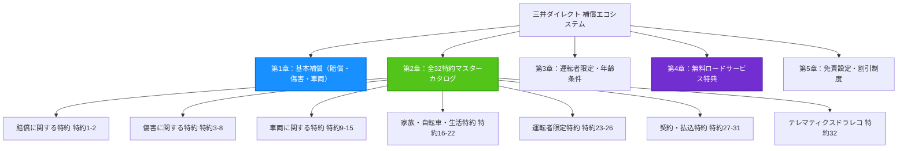

# 自動車保険 付帯可能特約・補償オプション一覧カタログ
## 約款に規定された全補償・全32特約・ロードサービス徹底解説

> **引受保険会社：** 三井ダイレクト損害保険株式会社  
> **対象約款冊子：** [`uploads/policy-booklets/policywording_car_20250401_to_20260331.pdf`](../uploads/policy-booklets/policywording_car_20250401_to_20260331.pdf)（有効期間: 2025年4月1日〜2026年3月31日）  
> **ロードサービス規約：** [`uploads/roadside-terms/roadservice_from_20250401.pdf`](../uploads/roadside-terms/roadservice_from_20250401.pdf)（有効期間: 2025年4月1日〜現在）  
> **対象契約（証券番号）：** POL-SAMPLE-202501（日産 エクストレイル SNT33 e-POWER / e-4ORCE）  
> **作成日：** 2026年9月21日  

---

## エグゼクティブ・サマリー（総括）

自動車保険の保険証券には、ご契約時に選択した補償項目のみが記載されています。しかし、保険会社が発行する「普通保険約款・特約」には、ご自身のライフスタイルや車両特性に合わせて追加・変更できる多種多様な特約・オプションが存在します。

本カタログレポートは、三井ダイレクト損保の約款に規定された**「全基本補償」「全32種類の特約条項」「ロードサービス特典」「免責設定および各種割引制度」**を網羅し、現在のご契約における付帯状況（**【付帯中 ✅】**・**【追加可能 ➕】**・**【自動付帯 🔹】**）と「どのような人が追加すべきか」を分かりやすく体系化したものです。



---

## 目次
1. [第1章：基本補償ラインナップ（普通保険約款）](#第1章基本補償ラインナップ普通保険約款)
2. [第2章：全32特約マスターカタログ（特約一覧）](#第2章全32特約マスターカタログ特約一覧)
   - [2.1 賠償に関する特約（特約1〜2）](#21-賠償に関する特約特約12)
   - [2.2 傷害に関する特約（特約3〜8）](#22-傷害に関する特約特約38)
   - [2.3 車両に関する特約（特約9〜15）](#23-車両に関する特約特約915)
   - [2.4 家族・自転車・日常生活に関する特約（特約16〜22）](#24-家族自転車日常生活に関する特約特約1622)
   - [2.5 運転者限定・年齢条件に関する特約（特約23〜26）](#25-運転者限定年齢条件に関する特約特約2326)
   - [2.6 契約手続き・保険料払込に関する特約（特約27〜31）](#26-契約手続き保険料払込に関する特約特約2731)
   - [2.7 ドライブレコーダー特約（特約32）](#27-ドライブレコーダー特約特約32)
3. [第3章：無料付帯ロードサービス・遠方トラブルサポート](#第3章無料付帯ロードサービス遠方トラブルサポート)
4. [第4章：免責金額（自己負担額）設定と割引制度](#第4章免責金額自己負担額設定と割引制度)
5. [第5章：タイプ別「誰がどの特約をつけるべきか？」推奨ガイド](#第5章タイプ別誰がどの特約をつけるべきか推奨ガイド)
6. [第6章：保険期間の途中（マイページ）での補償追加・変更手順](#第6章保険期間の途中マイページでの補償追加変更手順)

---

## 第1章：基本補償ラインナップ（普通保険約款）

| 補償項目 | 選択可能な補償限度額・タイプ | 現在のご契約状況 | 該当条文・頁 | 補償内容の概要 |
|---|---|---|---|---|
| **対人賠償保険** | • **無制限**（標準推奨）<br>• 個別設定額（1億円、2億円等） | **【付帯中 ✅】**<br>限度額：無制限 | 第1章 対人賠償条項<br>第2条・第4条・第11条<br>📑 **13〜15頁** | 自動車事故により他人を死傷させ、自賠責保険の支払上限を超える法律上の損害賠償責任を負った場合に補償。臨時費用保険金（10万〜20万円）を含む。 |
| **対物賠償保険** | • **無制限**（標準推奨）<br>• 個別設定額（1,000万、2,000万円等） | **【付帯中 ✅】**<br>限度額：無制限 | 第2章 対物賠償条項<br>第2条・第4条・第11条<br>📑 **15〜16頁** | 他人の車、家屋、電柱、ガードレール等の財物損壊、および鉄道軌道への立ち入りによる運行不能損害の賠償責任を時価額まで補償。 |
| **人身傷害保険** | • **保険金額：** 3,000万円 / 5,000万円 / 7,000万円 / 1億円 / 無制限<br>• **範囲A：** 車内・車外補償（特約3セット）<br>• **範囲B：** 車内のみ補償（保険料節約型） | **【付帯中 ✅】**<br>限度額：3,000万円<br>（車内・車外補償） | 第3章 人身傷害条項<br>第2条・第3条・第4条<br>📑 **16〜18頁** | 過失割合にかかわらず、自動車事故によるご自身・同乗者・ご家族の実損害額（治療費・休業損害・精神的慰謝料）を基準に従い支払う。 |
| **車両保険** | • **一般タイプ：** 衝突・接触・単独スリップ・当て逃げ・台風・水没・火災・盗難を全面カバー<br>• **限定タイプ（エコノミー）：** 車対車事故＋限定危険（単独事故・当て逃げを除く）<br>• **未加入（なし）：** 補償なし | ❌ **【追加可能 ➕】**<br>*(現在：未加入)* | 第4章 車両条項<br>第2条・第4条・第5条<br>📑 **18〜19頁** | 契約車両自体の修理費または全損時価額を補償。床下に高電圧バッテリーを備えた400万円超のハイブリッドSUVでは、冠水ショートや単独事故での全損（自己負担数百万円）を避けるため最重要。 |

---

## 第2章：全32特約マスターカタログ（特約一覧）

約款のしおり68ページ「特約一覧」に記載された**全32種類の特約**の完全一覧です。

```
┌────────────────────────────────────────────────────────────────────────────────────────┐
│                        約款規定 全32特約マスターインベントリ                           │
├────────────────────┬────────────────────────────────────┬──────────┬───────────────────┤
│ 特約番号           │ 特約名称（約款正式名称）           │ 約款頁   │ 現在の付帯状況    │
├────────────────────┼────────────────────────────────────┼──────────┼───────────────────┤
│ 特約 (1)           │ 対物超過修理費用補償特約           │ 32頁     │ 【付帯中 ✅】     │
│ 特約 (2)           │ 被害者救済費用特約 (不正アクセス等)│ 33頁     │ 【自動付帯 🔹】   │
│ 特約 (3)           │ 自動車事故特約 (人身傷害車外拡張)  │ 34頁     │ 【付帯中 ✅】     │
│ 特約 (4)           │ 自損事故傷害特約                   │ 35頁     │ 【追加可能 ➕】   │
│ 特約 (5)           │ 無保険車傷害特約                   │ 37頁     │ 【追加可能 ➕】   │
│ 特約 (6)           │ 搭乗者傷害特約（傷害一時金払）     │ 39頁     │ 【追加可能 ➕】   │
│ 特約 (7)           │ 搭乗者傷害特約（死亡・後遺障害）   │ 40頁     │ 【付帯中 ✅】     │
│ 特約 (8)           │ 搭傷医療倍額支払特約               │ 41頁     │ 【追加可能 ➕】   │
│ 特約 (9)           │ 新車特約                           │ 41頁     │ 【追加可能 ➕】   │
│ 特約 (10)          │ 車両全損時復旧費用補償特約         │ 42頁     │ 【追加可能 ➕】   │
│ 特約 (11)          │ 車両保険無過失事故特約             │ 43頁     │ 【追加可能 ➕】   │
│ 特約 (12)          │ 車両危険限定補償特約 (限定タイプ)  │ 44頁     │ 【追加可能 ➕】   │
│ 特約 (13)          │ 車両保険免責金額特約 (免責ゼロ等)  │ 44頁     │ 【追加可能 ➕】   │
│ 特約 (14)          │ 身の回り品補償特約                 │ 45頁     │ 【追加可能 ➕】   │
│ 特約 (15)          │ レンタカー費用補償特約（実損払）   │ 46頁     │ 【追加可能 ➕】   │
│ 特約 (16)          │ 他車運転危険補償特約               │ 48頁     │ 【自動付帯 🔹】   │
│ 特約 (17)          │ ファミリーバイク特約（賠償損害）   │ 49頁     │ 【追加可能 ➕】   │
│ 特約 (18)          │ ファミリーバイク特約（自損傷害型） │ 49頁     │ 【追加可能 ➕】   │
│ 特約 (19)          │ ファミリーバイク特約（人身傷害型） │ 50頁     │ 【追加可能 ➕】   │
│ 特約 (20)          │ 自転車・車いす・ベビーカー等定額特約│ 51頁     │ 【追加可能 ➕】   │
│ 特約 (21)          │ 自動車事故弁護士費用等補償特約     │ 53頁     │ 【付帯中 ✅】     │
│ 特約 (22)          │ 日常生活賠償責任補償特約           │ 56頁     │ 【追加可能 ➕】   │
│ 特約 (23)          │ 運転者家族限定特約                 │ 58頁     │ 【追加可能 ➕】   │
│ 特約 (24)          │ 運転者本人・配偶者限定特約         │ 58頁     │ 【追加可能 ➕】   │
│ 特約 (25)          │ 運転者本人限定特約                 │ 59頁     │ 【付帯中 ✅】     │
│ 特約 (26)          │ 運転者年齢限定特約 (21/26/35歳)    │ 59頁     │ 【付帯中 ✅】     │
│ 特約 (27)          │ 保険証券不発行特約 (ｅサービス)    │ 60頁     │ 【付帯中 ✅】     │
│ 特約 (28)          │ スマート継続手続特約               │ 60頁     │ 【自動付帯 🔹】   │
│ 特約 (29)          │ 保険料分割払特約                   │ 61頁     │ 【追加可能 ➕】   │
│ 特約 (30)          │ 分割払追加保険料特約               │ 62頁     │ 【追加可能 ➕】   │
│ 特約 (31)          │ クレジットカード払込特約           │ 63頁     │ 【付帯中 ✅】     │
│ 特約 (32)          │ ドライブレコーダー事故通知特約     │ 64頁     │ 【追加可能 ➕】   │
└────────────────────┴────────────────────────────────────┴──────────┴───────────────────┘
```

---

### 2.1 賠償に関する特約（特約1〜2）

#### （１）対物超過修理費用補償特約
- **付帯状況：** **【付帯中 ✅】**（上限50万円）
- **約款参照：** 特約条項(1)、📑 **32〜33ページ**、第2条・第3条・第6条
- **補償概要：** 相手方車両の修理費が時価額を上回り法律上の全損となった場合、時価額を超える修理費用について、お客さまの過失割合に応じた額を50万円限度で支払う。事故日から6ヶ月以内の実修理完了が条件。

#### （２）不正アクセス・車両の欠陥等による事故の被害者救済費用特約
- **付帯状況：** **【自動付帯 🔹】**
- **約款参照：** 特約条項(2)、📑 **33〜34ページ**、第2条・第3条・第5条
- **補償概要：** 外部からのサイバー攻撃（ハッキング）や車両構造上の欠陥に起因して事故が発生し、運転者に法律上の過失がない場合であっても、被害者への損害賠償金を補償する特約。

---

### 2.2 傷害に関する特約（特約3〜8）

#### （３）自動車事故特約
- **付帯状況：** **【付帯中 ✅】**
- **約款参照：** 特約条項(3)、📑 **34〜35ページ**、第2条・第3条
- **補償概要：** 人身傷害保険の補償対象を広げ、契約車両に乗車中だけでなく、歩行中・自転車運転中、または他人の車・バス・タクシー等に乗車中の自動車事故による死傷も補償する。

#### （４）自損事故傷害特約
- **付帯状況：** **【追加可能 ➕】**
- **約款参照：** 特約条項(4)、📑 **35〜37ページ**、第2条・第3条・第6条
- **補償概要：** 電柱衝突や崖からの転落など相手のいない単独事故で、運転者や搭乗者が死傷した場合の定額補償（死亡1,500万円等）。

#### （５）無保険車傷害特約
- **付帯状況：** **【追加可能 ➕】**
- **約款参照：** 特約条項(5)、📑 **37〜39ページ**、第2条・第3条・第6条
- **補償概要：** 相手車両が無保険または当て逃げで十分な損害賠償が受けられない場合に、被保険者1名につき最大2億円まで損害賠償請求額を支払う。

#### （６）搭乗者傷害危険補償特約（傷害一時金払）
- **付帯状況：** **【追加可能 ➕】**
- **約款参照：** 特約条項(6)、📑 **39〜40ページ**、第2条・第3条・第6条
- **補償概要：** 契約車両の搭乗者がケガをし、4日または5日以上の通院・入院となった場合に、治療費計算を待たずに定額（10万円等）の一時金をスピーディに給付する。

#### （７）搭乗者傷害危険補償特約（死亡・後遺障害）
- **付帯状況：** **【付帯中 ✅】**（上限300万円）
- **約款参照：** 特約条項(7)、📑 **40〜41ページ**、第2条・第3条・第6条・第7条
- **補償概要：** 事故日から180日以内の死亡時に定額300万円、後遺障害時に等級に応じた定額（4%〜100%）を、人身傷害保険とは別枠で上乗せ給付する。

#### （８）搭乗者傷害の医療保険金倍額支払に関する特約
- **付帯状況：** **【追加可能 ➕】**
- **約款参照：** 特約条項(8)、📑 **41ページ**、第2条・第3条
- **補償概要：** 事故時にシートベルトを適正に着用していた場合、搭乗者傷害特約の医療保険金を通常の2倍支払う。

---

### 2.3 車両に関する特約（特約9〜15）

*(※これらはベースとなる「車両保険」を付帯した場合にセット可能)*

#### （９）新車特約（車両全損時新車買替特約）
- **付帯状況：** **【追加可能 ➕】**
- **約款参照：** 特約条項(9)、📑 **41〜42ページ**、第2条・第3条・第6条
- **補償概要：** 初度登録から1〜3年以内の新車について、損害額が協定保険価額の50%以上となった場合、新車再取得費用を満額支給（再取得諸費用最大20万円も支給）。

#### （１０）車両全損時復旧費用補償特約
- **付帯状況：** **【追加可能 ➕】**
- **約款参照：** 特約条項(10)、📑 **42〜43ページ**、第2条・第3条・第6条
- **補償概要：** 年式が経過して時価額が下がった車両において、時価額以上の修理費がかかった場合に、時価額に加えて所定の限度額（最大50万円）まで修理費用を支払う。

#### （１１）車両保険無過失事故特約
- **付帯状況：** **【追加可能 ➕】**（車両保険付帯時に自動セット）
- **約款参照：** 特約条項(11)、📑 **43〜44ページ**、第2条・第3条
- **補償概要：** 信号待ち停止中の追突事故など過失割合ゼロのもらい事故で自車を修理する際、車両保険を使っても**翌年のノンフリート等級が3等級ダウンせず、等級が保護される**。

#### （１２）車両危険限定補償特約（限定タイプ / エコノミー型）
- **付帯状況：** **【追加可能 ➕】**
- **約款参照：** 特約条項(12)、📑 **44ページ**、第2条・第3条
- **補償概要：** 自損事故や当て逃げを対象外とする代わりに、車対車衝突・火災・盗難・台風冠水を低廉な保険料（一般型の半額程度）で補償する。

#### （１３）車両保険の免責金額に関する特約（車対車免責ゼロ等）
- **付帯状況：** **【追加可能 ➕】**
- **約款参照：** 特約条項(13)、📑 **44〜45ページ**、第2条・第3条
- **補償概要：** 車両保険の自己負担額（免責金額）を柔軟に設定。「車対車免責ゼロ（1回目0円・2回目10万円）」や「5-10万円」「10-10万円」「定額10万円」が選択可能。

#### （１４）身の回り品補償特約
- **付帯状況：** **【追加可能 ➕】**
- **約款参照：** 特約条項(14)、📑 **45〜46ページ**、第2条・第3条・第6条
- **補償概要：** 車両事故や車上荒らしにより車内・トランク内に積載されていた私物（パソコン・カメラ・ゴルフバッグ・アウトドア用品・衣類）の損害を10万〜30万円まで補償（自己負担5,000円）。

#### （１５）レンタカー費用補償特約（実損払）
- **付帯状況：** **【追加可能 ➕】**
- **約款参照：** 特約条項(15)、📑 **46〜48ページ**、第2条・第3条・第6条
- **補償概要：** 事故による車両修理期間中、移動の足を確保するためのレンタカー基本料金を日額5,000円・7,000円・10,000円（最長30日間）まで実費支給。

---

### 2.4 家族・自転車・日常生活に関する特約（特約16〜22）

#### （１６）他車運転危険補償特約
- **付帯状況：** **【自動付帯 🔹】**
- **約款参照：** 特約条項(16)、📑 **48〜49ページ**、第2条・第3条・第4条
- **補償概要：** 友人の車など臨時に借りた他人の車を運転中に事故を起こした際、借りたお車の保険に優先して自身の対人・対物・人身傷害から保険金を支払う。

#### （１７）ファミリーバイク特約（賠償損害タイプ）
- **付帯状況：** **【追加可能 ➕】**
- **約款参照：** 特約条項(17)、📑 **49〜50ページ**、第2条・第3条
- **補償概要：** 125cc以下の原動機付自転車（原付・小型二輪）を運転中の事故で、他人にケガをさせたり物を壊した賠償責任を補償。等級ダウンなし。

#### （１８）ファミリーバイク特約（賠償・自損傷害タイプ）
- **付帯状況：** **【追加可能 ➕】**
- **約款参照：** 特約条項(18)、📑 **49〜50ページ**、第2条・第3条
- **補償概要：** 賠償責任に加え、バイク運転中の単独事故による死傷も定額補償。

#### （１９）ファミリーバイク特約（賠償・人身傷害タイプ）
- **付帯状況：** **【追加可能 ➕】**
- **約款参照：** 特約条項(19)、📑 **50〜51ページ**、第2条・第3条
- **補償概要：** バイク運転中の死傷損害を、人身傷害保険の算定基準（実損害額）で手厚く補償。

#### （２０）自転車・車いす・ベビーカー・シニアカー事故傷害定額払特約
- **付帯状況：** **【追加可能 ➕】**
- **約款参照：** 特約条項(20)、📑 **51〜53ページ**、第2条・第3条・第6条
- **補償概要：** 自転車運転中の転倒事故、歩行中に自転車に追突された事故、ベビーカーや車いす使用中の事故による死傷（死亡300万円、入院・後遺障害定額）を補償。

#### （２１）自動車事故弁護士費用等補償特約
- **付帯状況：** **【付帯中 ✅】**（上限300万円）
- **約款参照：** 特約条項(21)、📑 **53〜56ページ**、第2条・第3条・第5条・第7条
- **補償概要：** もらい事故など過失ゼロの事故で保険会社が示談代行できない場合、損害賠償請求にかかる弁護士費用を最大300万円、法律相談料を10万円まで実費補償。

#### （２２）日常生活賠償責任補償特約
- **付帯状況：** **【追加可能 ➕】**
- **約款参照：** 特約条項(22)、📑 **56〜58ページ**、第2条・第3条・第5条
- **補償概要：** 日本国内での日常生活における偶然な事故（自転車で歩行者をはねた、飼い犬が他人に噛みついた、洗濯機の水漏れで階下を水浸しにした等）の損害賠償責任を**無制限**で全額補償。示談交渉サービス付き。同居家族全員が対象。

---

### 2.5 運転者限定・年齢条件に関する特約（特約23〜26）

運転する方の範囲を絞ることで保険料を割り引く特約群です：

| 特約番号 | 特約名称 | 補償される範囲 | 現在の状況 | 該当条文 |
|---|---|---|---|---|
| **（２３）** | **運転者家族限定特約** | 記名被保険者、配偶者、同居親族、別居の未婚の子 | 【追加可能 ➕】 | 📑 **58頁** |
| **（２４）** | **運転者本人・配偶者限定特約** | 記名被保険者および配偶者 | 【追加可能 ➕】 | 📑 **58〜59頁** |
| **（２５）** | **運転者本人限定特約** | 記名被保険者単身のみ | **【付帯中 ✅】** *(最大割引)* | 📑 **59頁** |
| **（２６）** | **運転者年齢限定特約** | • 全年齢補償<br>• 21歳以上補償<br>• **26歳以上補償**<br>• 35歳以上補償 | **【付帯中 ✅】** *(26歳以上)* | 📑 **59〜60頁** |

---

### 2.6 契約手続き・保険料払込に関する特約（特約27〜31）

| 特約番号 | 特約名称 | 概要 | 現在の状況 | 該当条文 |
|---|---|---|---|---|
| **（２７）** | **保険証券の不発行に関する特約**<br>（ｅサービス特約） | 紙の証券を発行せずWebマイページで確認することで**年間500円割引**。 | **【付帯中 ✅】** | 📑 **60頁** |
| **（２８）** | **スマート継続手続特約** | 満期時に無保険期間を作らないよう自動継続する特約。 | **【自動付帯 🔹】** | 📑 **60〜61頁** |
| **（２９）** | **保険料分割払特約** | 年間保険料を12分割（月払い）で支払う特約。 | 【追加可能 ➕】 | 📑 **61〜62頁** |
| **（３０）** | **分割払の追加保険料特約** | 月払い契約における条件変更時の追徴規定。 | 【追加可能 ➕】 | 📑 **62〜63頁** |
| **（３１）** | **クレジットカード払込特約** | クレジットカード決済に関する規約。 | **【付帯中 ✅】** | 📑 **63〜64頁** |

---

### 2.7 ドライブレコーダー特約（特約32）

#### （３２）ドライブレコーダーによる事故発生の通知等に関する特約（レスキュードラレコ）
- **付帯状況：** **【追加可能 ➕】**
- **約款参照：** 特約条項(32)、📑 **64〜66ページ**、第2条・第3条・第5条
- **補償・機能：**
  - 保険会社専用の通信型ドライブレコーダー端末を貸与。
  - **自動事故通知:** 強い衝撃を検知すると自動で三井ダイレクト損保の安否確認デスクへ通信接続。
  - **映像自動送信:** 事故前後の映像を自動アップロードし、示談交渉での過失割合争いを迅速解決。
  - 安全運転スコア診断機能付き。

---

## 第3章：無料付帯ロードサービス・遠方トラブルサポート

「ロードサービス利用規約」に基づき、**車両保険の有無に関わらず全契約に無料自動セット**されています：

| サービス項目 | 無料サポート限度額・内容 | 利用条件・制約事項 | 規約条文 |
|---|---|---|---|
| 🚗 **指定工場へのレッカー** | **距離無制限（無料）** | 当社提携の指定修理工場への搬送。 | 第II章 1、📑 **6頁** |
| 🚗 **希望工場へのレッカー** | **100kmまで無料** | お客さま指定のディーラー・修理工場。 | 第II章 1、📑 **6頁** |
| ⚡ **電欠（バッテリー残量ゼロ）** | **最寄りの充電設備まで無制限無料** | EVおよびe-POWER等の電欠トラブルに対応。 | 第II章 1.②、📑 **6頁** |
| 🔋 **12Vバッテリージャンピング** | **保険期間中1回無料** | 12V補機バッテリーのみ（駆動バッテリーは不可）。 | 第II章 2.②、📑 **7頁** |
| ⛽ **ガソリン無料配達** | **10リットル無料（期間中1回）** | 高速道路・一般道でのガス欠時。 | 第II章 11、📑 **10頁** |
| 🛞 **スペアタイヤ交換** | **現場作業工賃無料** | 車両にスペアタイヤが積載されていること。 | 第II章 2.③、📑 **7頁** |
| 🔑 **インロック開錠** | **現場開錠工賃無料** | 一般シリンダー錠（特殊防犯錠を除く）。 | 第II章 2.①、📑 **7頁** |
| 🕳️ **落輪・脱輪引上げ** | **30,000円（税込）まで無料** | 落差1m以内、クレーン・ウインチ作業。 | 第II章 2.④、📑 **7頁** |
| 🚄 **緊急帰宅費用サポート** | **1名につき20,000円まで実費支給** | 自宅までの電車・バス・タクシー等（同乗者全員分）。 | 第II章 3、📑 **8頁** |
| 🏨 **臨時宿泊費用サポート** | **1名につき10,000円まで実費支給** | 最寄ホテルの宿泊代（同乗者全員分 / 電欠は対象外）。 | 第II章 4、📑 **8頁** |
| 🚙 **12時間無料レンタカー** | **12時間基本料金無料（5ナンバー車）** | 自宅から**直線50km以上**かつ**継続契約（2年目以降）**。 | 第II章 12、📑 **10頁** |
| 🚚 **修理完了後の車両搬送** | **100,000円まで無料** | 遠方工場から自宅までの陸送、または1名引取り交通費。 | 第II章 5、📑 **9頁** |

---

## 第4章：免責金額（自己負担額）設定と割引制度

### 車両保険免責金額のバリエーション
車両保険を付帯する場合、自己負担額（免責）の選択によって保険料を大きくコントロールできます：
1. **車対車免責ゼロ特約（0-10万円）：** 1回目の車対車事故は自己負担0円、2回目以降10万円。
2. **5-10万円：** 1回目5万円、2回目以降10万円。
3. **10-10万円：** 1回目・2回目ともに10万円（保険料を抑えたい場合に最適）。
4. **定額10万円：** 全事故で10万円。

### 適用可能な割引制度一覧
- **インターネット割引：** 新規Web申込で最大10,000円〜14,500円割引。
- **ｅサービス（証券不発行）割引：** 年間500円割引。
- **早期契約割引（早割）：** 満期日の45〜50日前の手続完了で割引。
- **ASV（安全運転支援装置）割引：** 自動ブレーキ搭載車なら9%割引。
- **ゴールド免許割引：** 運転免許証の色がゴールドの場合に適用される大幅割引。
- **セカンドカー割引：** 2台目以降を契約する際、6等級ではなく7等級（7S）からスタート。

---

## 第5章：タイプ別「誰がどの特約をつけるべきか？」推奨ガイド

```
┌────────────────────────────────────────────────────────────────────────────────────────┐
│                        タイプ別 特約セレクト・マトリクス                               │
├───────────────────────────────┬──────────────────────────────────────────┬─────────────┤
│ 該当するドライバー層          │ 強く推奨される追加特約                   │ 特約番号    │
├───────────────────────────────┼──────────────────────────────────────────┼─────────────┤
│ 🚗 高額車・ハイブリッド・EV   │ • 車両保険（一般型 または 限定型）       │ 第4章       │
│    （エクストレイル e-POWER） │ • 新車特約（登録3年以内）                │ 特約 (9)    │
│                               │ • レンタカー費用特約                     │ 特約 (15)   │
├───────────────────────────────┼──────────────────────────────────────────┼─────────────┤
│ 👨‍👩‍👧‍👦 子育て世帯・家族利用     │ • 日常生活賠償責任補償特約（自転車事故等）│ 特約 (22)   │
│                               │ • 自転車・ベビーカー等傷害定額特約       │ 特約 (20)   │
│                               │ • ファミリーバイク特約（原付利用時）     │ 特約 (17–19)│
├───────────────────────────────┼──────────────────────────────────────────┼─────────────┤
│ 🛡️ もらい事故・被害事故対策   │ • 自動車事故弁護士費用等補償特約         │ 特約 (21)   │
│                               │ • ドライブレコーダー特約（ドラレコ端末） │ 特約 (32)   │
├───────────────────────────────┼──────────────────────────────────────────┼─────────────┤
│ 🏌️ レジャー・アウトドア派    │ • 車内身の回り品補償特約                 │ 特約 (14)   │
│                               │ • 搭乗者傷害特約（一時金払）             │ 特約 (6)    │
├───────────────────────────────┼──────────────────────────────────────────┼─────────────┤
│ 🚙 年式の経ったお車（低時価） │ • 車両全損時復旧費用補償特約             │ 特約 (10)   │
│                               │ • 限定タイプ車両保険 ＋ 免責10-10万円    │ 特約 (12,13)│
└───────────────────────────────┴──────────────────────────────────────────┴─────────────┘
```

### 1. ハイブリッド・EVオーナー（日産 e-POWER / PHEV）への推奨
- **最大のリスク:** 床下に高電圧駆動用バッテリーを配置しているため、水深30〜40cmの冠水路走行でバッテリーが水没ショートし、150万〜250万円以上の即時全損となります。
- **推奨アクション:**
  - **「車両保険（限定タイプ）」の追加:** 盗難・火災・台風・冠水・車同士の衝突をカバー。
  - **「レンタカー費用特約」の追加:** 部品調達に日数がかかる電動車両の修理中も足止めされません。

### 2. 小中高校生のお子様がいる世帯・自転車利用世帯への推奨
- **最大のリスク:** 自転車走行中に歩行者と衝突し、億単位の賠償責任を負う判例が相次いでいます。
- **推奨アクション:**
  - **「日常生活賠償責任補償特約」の追加:** 月数十円〜数百円の負担で、家族全員の自転車事故や日常生活賠償を**無制限（示談代行付き）**でカバー。他で個人賠償保険に入っていない場合は必須です。

---

## 第6章：保険期間の途中（マイページ）での補償追加・変更手順

本カタログに掲載された特約や補償内容は、**年1回の満期を待たずに、保険期間の途中でも即日追加・変更が可能**です：

1. [三井ダイレクト損保 お客さまマイページ](https://www.mitsui-direct.co.jp/customer/) へログイン。
2. ご契約車両（証券番号：POL-SAMPLE-202501）の「補償内容の変更・特約の追加」を選択。
3. 希望する特約（例：「車両保険 限定タイプ」や「日常生活賠償特約」）にチェックを入れると、**その場で追加保険料（日割り計算）がリアルタイム表示**されます。
4. 変更適用日（即日または指定日）を選択し、登録クレジットカードで決済すれば手続き完了です。
