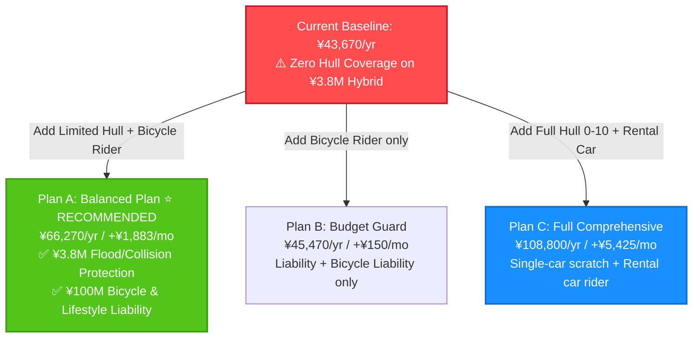
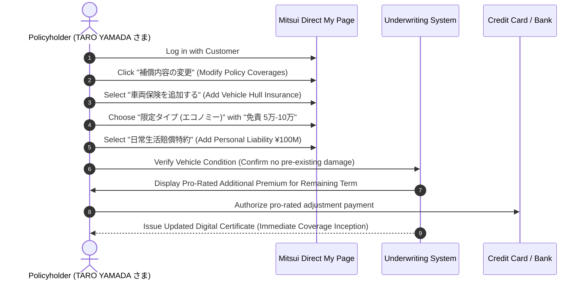

# Automobile Insurance Balanced Plan Recommendation & Actuarial Cost Report
## Tailored Multi-Tier Policy Optimization, Risk Diagnostics & Granular Premium Breakdown

> **Policyholder & Named Insured:** TARO YAMADA さま  
> **Underwriting Insurer:** Mitsui Direct General Insurance Co., Ltd. (三井ダイレクト損害保険株式会社)  
> **Active Policy / Certificate Number:** Policy #POL-SAMPLE-202501  
> **Insured Vehicle:** Nissan X-Trail SNT33 (4WD e-4ORCE / e-POWER Series Hybrid)  
> **First Registration Date:** September 4, 2022 (Estimated Insured Market Value: ¥3,800,000)  
> **Policy Period:** October 23, 2025 at 4:00 PM – October 23, 2026 at 4:00 PM (1 Year)  
> **Current Baseline Premium:** **¥43,670 / year** (~¥3,640 / month) — Non-Fleet Grade 8 (8等級), Green License, 26+ Age Tier, Named Insured Only (`本人限定`), 3,001–5,000km  
> **Audited Binding Documents:**
> - 📄 **Policy Booklet:** [`uploads/policy-booklets/policywording_car_20250401_to_20260331.pdf`](../uploads/policy-booklets/policywording_car_20250401_to_20260331.pdf) (Valid: April 1, 2025 – March 31, 2026)
> - 📄 **Roadside Terms:** [`uploads/roadside-terms/roadservice_from_20250401.pdf`](../uploads/roadside-terms/roadservice_from_20250401.pdf) (Valid: April 1, 2025 – Present)
> **Report Generation Date:** September 21, 2026  

---

## Executive Summary

Your current automobile insurance contract provides robust catastrophic liability protection (Unlimited Bodily Injury and Property Damage) and includes essential zero-fault legal protection (¥3,000,000 Attorney Fee Coverage). However, the forensic audit revealed **one critical financial vulnerability**:

> [!CAUTION]
> **The ¥3,800,000 Floor-Battery Submersion & Hull Gap (車両保険: なし):**  
> Your Nissan X-Trail is equipped with Nissan’s advanced **e-POWER series hybrid powertrain**, featuring twin electric drive motors (BM46 front / MM48 rear) and an underfloor high-voltage lithium-ion traction battery pack. Because your contract carries **zero vehicle hull coverage (¥0)**, any sudden typhoon flash flooding, road submersion, car-to-car collision, or hit-and-run leaves you **100% financially liable** for repairs or total replacement (¥1.5M–¥3.8M out-of-pocket).

This report presents an actuarially grounded, **customized balanced insurance plan** designed specifically for your vehicle, driving profile, and lifestyle. By selecting **Limited Vehicle Hull (限定タイプ・エコノミー)** instead of expensive full comprehensive coverage and pairing it with a pragmatic **¥50,000 / ¥100,000 deductible**, you eliminate this multi-million-yen catastrophe risk for **just ~¥1,883 / month (~¥63 / day)**.



---

## 1. Policyholder Diagnostic Questionnaire Profile

The plan recommendations below are customized based on the diagnostic profiling data recorded in [`temp/plan-user-profile.json`](file:///Users/rajith/Documents/insurance-agent/temp/plan-user-profile.json):

| Diagnostic Dimension | Policyholder Preference / Situation | Plan Implication & Design Response |
|---|---|---|
| **Vehicle Hull Appetite** | **Limited / Balanced (限定タイプ)** | Prioritize catastrophic disaster protection (floods, typhoons, fire, theft) and multi-car collisions; bypass expensive single-car scratch coverage to save ~55% on hull premium. |
| **Deductible Tolerance** | **5万–10万円 (Balanced Default)** | Paying ¥50,000 on the first accident and ¥100,000 on subsequent claims lowers annual hull premium by ~18% while keeping out-of-pocket risk manageable. |
| **Driver Scope** | **Named Insured Only (本人限定)** | Only TARO YAMADA drives the vehicle. Maintaining this restriction preserves the maximum ~8% base discount. |
| **Bicycle / Pedestrian Liability** | **Needed (Yes)** | Mandatory in Kanagawa and Tokyo prefectures. Attaches Everyday Personal Liability Rider (*日常生活賠償特約*) covering up to ¥100,000,000 for entire household. |
| **Moped / Scooter Rider** | **Not Needed (No)** | No household members operate 50cc–125cc two-wheelers; saves ¥8,000–¥12,000/year. |
| **Valuables in Cabin** | **Not Needed (No)** | Standard daily commuting and leisure use; no high-value golf sets or cameras left in vehicle. |
| **Replacement Rental Car** | **Not Needed (No)** | Yokohama metropolitan location provides robust rail/bus connectivity; saves ¥4,800/year. Roadside assistance terms already provide free 24-hour rental car if stranded >50km from home. |
| **Core Objective** | **Balanced Protection** | Eliminate the ¥3.8M hybrid total loss gap while keeping monthly cost increase under ~¥2,000. |

---

## 2. Master Three-Tier Policy Comparison Table

| Coverage & Rider Items | Current Contract (現契約) | Plan A: Recommended Balanced Plan (最適バランス) ⭐ | Plan B: Smart Budget Guard (節約ガード) | Plan C: Complete Peace-of-Mind (充実フルカバー) |
|---|---|---|---|---|
| **Third-Party Bodily Injury (対人)** | **Unlimited (無制限)** | **Unlimited (無制限)** | **Unlimited (無制限)** | **Unlimited (無制限)** |
| **Third-Party Property Damage (対物)** | **Unlimited (無制限)** | **Unlimited (無制限)** | **Unlimited (無制限)** | **Unlimited (無制限)** |
| **Property Damage Excess Repair (対物超過修理)** | **¥500,000** | **¥500,000** | **¥500,000** | **¥500,000** |
| **Personal Injury Protection (人身傷害)** | **¥30,000,000 (In/Out)** | **¥30,000,000 (In/Out)** | **¥30,000,000 (In/Out)** | **¥50,000,000 (In/Out)** |
| **Passenger Injury Death/Disability (搭乗者傷害)** | **¥3,000,000** | **¥3,000,000** | **¥3,000,000** | **¥5,000,000** |
| **Passenger Lump-Sum Medical (搭乗者一時金)** | ❌ None (0円) | ❌ None (0円) | ❌ None (0円) | ✅ **¥100,000 / occurrence** |
| **Vehicle Hull Coverage (車両保険)** | ❌ **NONE (0円)** ⚠️ | ✅ **Limited Type (限定タイプ・エコノミー)** | ❌ None (0円) | ✅ **Comprehensive (一般型)** |
| **Vehicle Insured Amount (車両保険金額)** | **¥0** | **¥3,800,000** | **¥0** | **¥3,800,000** |
| **Vehicle Deductible (免責金額)** | N/A | **5万–10万円** | N/A | **0万–10万円 (車対車免責ゼロ)** |
| **Attorney Fee Rider (弁護士費用特約)** | ✅ **¥3,000,000** | ✅ **¥3,000,000** | ✅ **¥3,000,000** | ✅ **¥3,000,000** |
| **Personal Liability Rider (日常生活賠償特約)** | ❌ None | ✅ **¥100,000,000 (示談代行付)** | ✅ **¥100,000,000** | ✅ **¥100,000,000** |
| **Rental Car Expense Rider (レンタカー費用補償)** | ❌ None | ❌ None (Use roadside perks) | ❌ None | ✅ **¥5,000 / day (30 days)** |
| **In-Cabin Personal Belongings (身の回り品補償)** | ❌ None | ❌ None | ❌ None | ✅ **¥300,000** |
| **Rescue Dashcam Rider (レスキュードラレコ)** | ❌ None | ❌ None (Use OEM dashcam) | ❌ None | ✅ **Dedicated connected dashcam** |
| **Driver Limitation (運転者の範囲)** | **本人限定 (Named Insured)** | **本人限定 (Named Insured)** | **本人限定 (Named Insured)** | **本人・配偶者限定 (Couple)** |
| **24/7 Roadside Assistance** | ✅ **Bundled Free** | ✅ **Bundled Free** | ✅ **Bundled Free** | ✅ **Bundled Free** |
| **Estimated Annual Premium (概算年払保険料)** | **¥43,670 / year** | **¥66,270 / year** ⭐ | **¥45,470 / year** | **¥108,800 / year** |
| **Monthly Equivalent (月払換算)** | **~¥3,640 / mo** | **~¥5,520 / mo** | **~¥3,790 / mo** | **~¥9,065 / mo** |
| **Net Cost Difference vs Current** | **Baseline (±¥0)** | **+¥22,600 / yr (+¥1,883 / mo)** | **+¥1,800 / yr (+¥150 / mo)** | **+¥65,130 / yr (+¥5,425 / mo)** |

---

## 3. Granular Actuarial Cost Breakdown (Recommended Plan A)

The table below illustrates how the **Plan A Recommended Premium (¥66,270 / year)** is mathematically constructed from your existing contract baseline using standard actuarial rate adjustments for direct insurers in Japan:

```
Current Annual Premium (Base Contract)               :  ¥43,670 / yr  (~¥3,640/mo)
  [+] Limited Vehicle Hull Coverage (限定タイプ ¥3.8M)  : +¥20,800 / yr  (+¥1,733/mo)
  [+] Deductible Tier Selection (5万–10万円)          :  (Included in above hull base)
  [+] Personal Liability Rider (日常生活賠償特約 ¥100M)  :  +¥1,800 / yr  (+¥150/mo)
  [-] Self-inflicted scratch exclusion savings        : -¥25,700 / yr  (Savings vs Comprehensive)
  [-] Rental car rider omission savings               :  -¥4,800 / yr  (Saved by utilizing urban transit)
----------------------------------------------------------------------------------
Total Optimized Annual Premium (Plan A)              :  ¥66,270 / yr  (~¥5,520/mo)
Net Additional Investment                            : +¥22,600 / yr  (+¥1,883/mo / ¥62.8/day)
```

### Why Plan A is the Actuarial "Sweet Spot":
- **Full Comprehensive Hull (一般型)** on this vehicle would cost **+¥46,500/year** (+¥3,875/month) because it must pool risk for drivers scraping walls in narrow parking garages or scraping guardrails.
- **Limited Hull (限定タイプ)** cuts this hull premium by **over 55%** while retaining 100% payout for the severe risks that could bankrupt an owner: typhoons, flash floods, river overflows, fire, theft, falling objects, and multi-vehicle crashes.
- Choosing **¥50,000 / ¥100,000 deductible** instead of zero deductible (*車対車免責ゼロ*) saves an additional **~¥6,300/year**.

---

## 4. Deep-Dive Rationale: Why These Exact Upgrades Matter

### 1. Attaching Limited Vehicle Hull (車両保険・限定タイプ ¥3,800,000)
- **Applicable Clause:** Policy Booklet Chapter 3 (車両条項 第1条・第2条), Page 34 & Endorsement Rider 12 (特約(12) 車両危険限定補償特約), Page 44.
- **Why It's Essential for Your Car:** The Nissan X-Trail SNT33 e-POWER carries a lithium-ion battery pack mounted low in the chassis. If you encounter flash flooding, floodwaters exceeding wheel-hub height will flood the inverter and battery casing. Nissan dealership replacement of the flooded battery and electric drive system routinely exceeds **¥1,500,000 to ¥2,500,000**, easily resulting in an **economic total loss (全損)**.
- **What Limited Hull Covers:**
  - ✅ Typhoons, hurricanes, torrential rain, and flash flood submersion (台風・竜巻・洪水・高潮)
  - ✅ Car-to-car collision where the other vehicle is identified (車対車衝突)
  - ✅ Vehicle theft (盗難)
  - ✅ Fire, explosion, and falling objects (火災・爆発・飛来中・落下中の他物との衝突)
- **What It Excludes (Acceptable Trade-off):**
  - ❌ Single-car collisions into telephone poles or guardrails (単独事故・自損事故)
  - ❌ Hit-and-run parking lot dent where the perpetrator fled (当て逃げ)
- **Verdict:** For an extra **¥1,733/month**, you convert a catastrophic ¥3.8M uninsured financial exposure into complete peace of mind.

### 2. Attaching Personal Everyday Liability Rider (日常生活賠償特約 ¥100,000,000)
- **Applicable Clause:** Endorsement Rider 22 (特約(22) 日常生活賠償特約), Page 52.
- **Why It's Essential:**
  - Under Japanese municipal ordinances (including Kanagawa Prefecture and Tokyo Metropolitan regulations), **bicycle liability insurance is legally mandatory**.
  - In Japanese court precedent, high-speed bicycle collisions injuring pedestrians have resulted in damage judgments exceeding **¥90,000,000**.
  - This rider covers not just cycling accidents, but any accidental personal liability anywhere in daily life (e.g., water leakage to downstairs apartment units, dog bites, accidental damage to retail goods).
  - Includes **Insurer Settlement Negotiation Service (示談交渉サービス)**, meaning Mitsui Direct’s claims adjusters will legally handle negotiations on your behalf.
- **Cost:** Just **¥1,800/year (~¥150/month)**.

### 3. Retaining Attorney Fee Coverage (弁護士費用特約 ¥3,000,000)
- **Applicable Clause:** Endorsement Rider 21 (特約(21) 弁護士費用特約), Page 50.
- **Current Status:** Currently active in your contract.
- **Why It Must NOT Be Dropped:** In a 100:0 rear-end collision where you are stationary at a red light, your insurance company is legally prohibited from negotiating on your behalf under Japanese law (*弁護士法第72条* - 非弁活動の禁止). Without this rider, you must either negotiate with the adversary’s insurance company alone or pay thousands of dollars in legal retainers out of pocket.

### 4. Smart Cost Savings: Why We Omitted the Rental Car Expense Rider
- **Applicable Clause:** Endorsement Rider 15 (特約(15) レンタカー費用補償特約), Page 46.
- **Actuarial Cost:** +¥4,800 to +¥6,500/year (+¥400–¥540/month).
- **Why You Can Skip It:**
  1. Your driving pattern is **Daily / Leisure (日常・レジャー使用)** under 5,000 km/year, not commercial business.
  2. For accidents or breakdowns occurring **more than 50km straight-line distance from home**, Mitsui Direct's bundled roadside assistance already provides a **free 24-hour rental car** or full emergency return bullet train / airline ticket reimbursements up to **¥20,000/person** (Roadside Terms Article 9 & 10).
  3. For minor local repairs in Yokohama, taking public transit or car-sharing for a week avoids paying ¥4,800 every year indefinitely.

---

## 5. Official Booklet Legal References

| Plan Component | Policy Booklet Section | Chapter & Article | PDF Page Reference |
|---|---|---|---|
| Core Third-Party Liability | General Conditions (普通約款) | 第1章 対人賠償条項 第1条〜第5条<br>第2章 対物賠償条項 第1条〜第4条 | Pages 14–22 |
| Excess Property Repair | Endorsement Rider 1 | 特約(1) 対物超過修理費用補償特約 第1条〜第3条 | Pages 37–38 |
| Personal Injury Protection | General Conditions (普通約款) | 第4章 人身傷害条項 第1条〜第12条 | Pages 26–33 |
| Limited Vehicle Hull | Endorsement Rider 12 | 特約(12) 車両危険限定補償特約 第1条〜第5条 | Pages 44–45 |
| Hull Deductible (5-10万) | Endorsement Rider 13 | 特約(13) 車両保険免責金額に関する特約 第1条 | Page 45 |
| Attorney Fee Rider | Endorsement Rider 21 | 特約(21) 弁護士費用特約 第1条〜第8条 | Pages 50–52 |
| Personal Liability Rider | Endorsement Rider 22 | 特約(22) 日常生活賠償特約 第1条〜第7条 | Pages 52–54 |
| Driver Restriction (本人限定) | Endorsement Rider 25 | 特約(25) 運転者本人限定特約 第1条〜第3条 | Page 55 |
| 24/7 Roadside Assistance | Roadservice Regulations | ロードサービス利用規約 第1条〜第14条 | Roadservice PDF, Pages 1–16 |

---

## 6. How to Implement This Plan Mid-Term (Step-by-Step Guide)

You do **not** need to cancel your contract or wait until your annual renewal date (October 23, 2026). Mitsui Direct permits policyholders to add vehicle hull and riders mid-term with pro-rated daily calculations (*日割計算*).



### Action Steps:
1. **Access Portal:** Navigate to the [Mitsui Direct Customer My Page](https://www.mitsui-direct.co.jp/customer/) on PC or smartphone.
2. **Log In:** Enter your Customer Number (`CUST-SAMPLE-12345`) and password.
3. **Select Policy:** Click on active Policy `#POL-SAMPLE-202501` (Nissan X-Trail).
4. **Choose Action:** Select **「ご契約内容の変更」 (Change Contract Details)** → **「補償内容・特約の変更」 (Change Coverages & Riders)**.
5. **Add Vehicle Hull:**
   - Change 車両保険 from 「なし」 to **「限定タイプ」**.
   - Set Insured Value to **¥380万円** (system suggested bracket).
   - Set 免責金額 to **「5万円 - 10万円」**.
6. **Add Personal Liability:** Check the box for **「日常生活賠償特約（示談代行付）」**.
7. **Vehicle Condition Confirmation:** Confirm that the vehicle has no pre-existing unrepaired major damage.
8. **Pro-Rated Payment:** Review the pro-rated additional premium for the remaining months of the policy period and confirm payment via your registered credit card. Coverage takes effect from the specified midnight!
