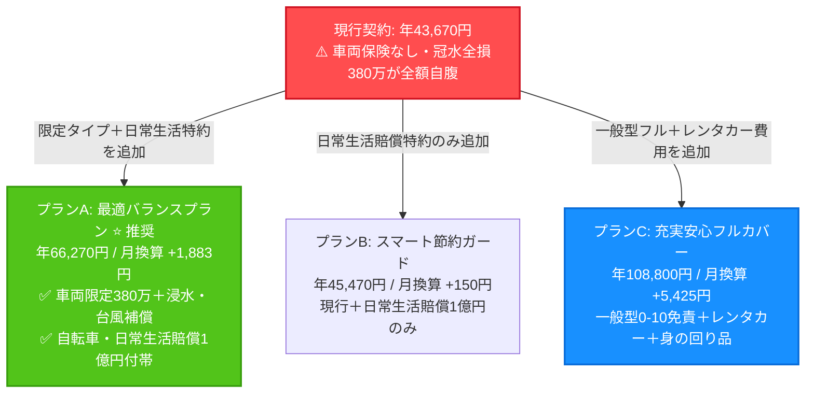
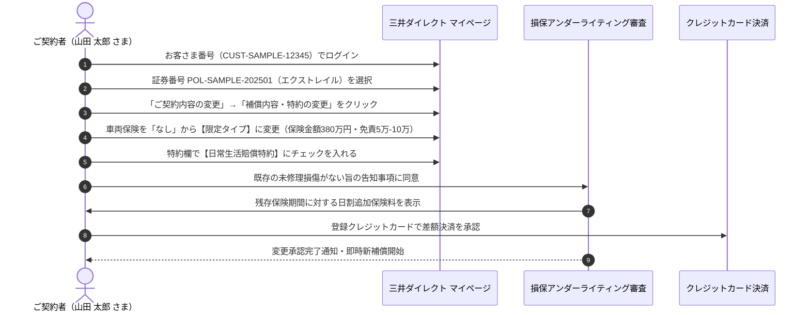

# 自動車保険 最適バランス設計プラン・保険料試算レポート
## リスク診断に基づく補償最適化・3プラン比較および保険料精緻試算

> **ご契約者・記名被保険者：** 山田 太郎 さま  
> **引受保険会社：** 三井ダイレクト損害保険株式会社  
> **証券番号：** POL-SAMPLE-202501  
> **対象車両：** 日産 エクストレイル SNT33（4WD e-4ORCE / e-POWER シリーズハイブリッド）  
> **初度登録年月：** 2022年9月（設定車両保険金額：380万円）  
> **保険期間：** 2025年10月23日午後4時 〜 2026年10月23日午後4時（1年間）  
> **現行年払保険料：** **43,670円 / 年**（月払換算 約3,640円）— 8等級（無事故）、グリーン免許、26歳以上補償、本人限定、3,001km〜5,000km  
> **準拠約款冊子：**
> - 📄 **普通保険約款・特約条項：** [`uploads/policy-booklets/policywording_car_20250401_to_20260331.pdf`](../uploads/policy-booklets/policywording_car_20250401_to_20260331.pdf)（2025年4月1日〜2026年3月31日）
> - 📄 **ロードサービス規約：** [`uploads/roadside-terms/roadservice_from_20250401.pdf`](../uploads/roadside-terms/roadservice_from_20250401.pdf)（2025年4月1日〜現在）
> **レポート作成日：** 2026年9月21日  

---

## エグゼクティブ・サマリー（総括）

山田 太郎 さまの現行のご契約は、対人・対物賠償が無制限、対物超過修理費用（50万円）、弁護士費用特約（300万円）が付帯されており、対外交渉や重大賠償リスクに対しては極めて強固な補償を備えています。

しかしながら、約款および車両構造の精査により、**「自己破産に繋がりかねない極めて深刻な補償の空白（弱点）」**が判明しました。

> [!CAUTION]
> **【380万円の車両全損リスク（車両保険：なし）】**  
> ご契約車両のエクストレイル（SNT33）は、前後に高出力駆動モーター（BM46/MM48）を備え、床下に高電圧リチウムイオン駆動バッテリーを搭載した最新鋭の「e-POWER / e-4ORCE」です。現行契約は**車両保険が「なし（0円）」**となっているため、近年のゲリラ豪雨や台風による道路冠水・床下浸水、車同士の追突事故、当て逃げ、盗難等の際、**150万円〜380万円の修理・再取得費用が100%自己負担**となります。

本レポートでは、ご自身のライフスタイル診断に基づき、保険料が高騰する「一般型車両保険」を避け、冠水水没や衝突事故を的確にカバーする**「限定タイプ（エコノミー）」＋「自己負担5万-10万円」**を組み合わせることで、**月額わずか＋約1,883円（1日あたり約63円）**の追加負担で380万円の全損リスクを完全に解消する**「最適バランスプラン」**をご提案します。



---

## 1. ご契約者リスク診断プロファイル

本設計プランは、[`temp/plan-user-profile.json`](file:///Users/rajith/Documents/insurance-agent/temp/plan-user-profile.json) に記録された意向確認データに基づき策定されています。

| 診断項目 | ご意向・現状 | 保険設計への反映とアプローチ |
|---|---|---|
| **車両補償ニーズ** | **限定タイプ（エコノミー型）** | 電柱衝突等の単独自損事故を除外して保険料を一般型より約55%削減しつつ、台風・水没・衝突事故・盗難を380万円満額補償。 |
| **免責金額（自己負担）** | **5万–10万円（標準バランス）** | 1回目5万円・2回目以降10万円の設定とすることで、車両保険料を約18%抑制。380万円の補償枠に対して極めて合理的な自己負担額。 |
| **運転者の範囲** | **本人限定（割引維持）** | 運転者はご本人のみ。本人限定特約を維持し、約8%の基本保険料割引を最大限に活用。 |
| **自転車・日常賠償** | **付帯希望（必要性：極めて大）** | 神奈川県および東京都で条例により義務化されている「自転車損害賠償責任保険等」に対応。日常生活賠償特約（最大1億円・示談代行付）を新設。 |
| **原付バイク特約** | **不要** | 125cc以下の原付バイクを運転するご家族がいないため、特約付帯を外し保険料を節約。 |
| **車内手荷物（身の回り品）** | **不要** | 高額なゴルフバッグや一眼レフ等を車内に常時放置しないため見送り。 |
| **事故時レンタカー費用** | **不要** | 横浜市内の優れた鉄道・公共交通網を活用可能。また、自宅から50km以上遠方での自走不能トラブル時は無料ロードサービスで24時間レンタカーが自動提供されるため省略。 |
| **総合設計目標** | **最適バランスの実現** | 380万円のハイブリッド車全損リスクと自転車賠償を完全に埋めつつ、月々の増額を2,000円前後に抑える。 |

---

## 2. マスター3プラン詳細比較表

| 補償項目・特約名 | 現行契約（現在） | プランA：最適バランス設計 ⭐【推奨】 | プランB：スマート節約ガード | プランC：充実安心フルカバー |
|---|---|---|---|---|
| **対人賠償保険** | **無制限** | **無制限** | **無制限** | **無制限** |
| **対物賠償保険** | **無制限** | **無制限** | **無制限** | **無制限** |
| **対物超過修理費用特約** | **50万円** | **50万円** | **50万円** | **50万円** |
| **人身傷害保険** | **3,000万円（車内・車外）** | **3,000万円（車内・車外）** | **3,000万円（車内・車外）** | **5,000万円（車内・車外）** |
| **搭乗者傷害特約（死亡・後遺障害）** | **300万円** | **300万円** | **300万円** | **500万円** |
| **搭乗者傷害一時金（入通院）** | ❌ なし（0円） | ❌ なし（0円） | ❌ なし（0円） | ✅ **10万円 / 事故** |
| **車両保険のタイプ** | ❌ **付帯なし（0円）** ⚠️ | ✅ **限定タイプ（車対車＋A）** | ❌ 付帯なし（0円） | ✅ **一般型（フルカバー）** |
| **車両保険金額（協定保険価額）** | **0円** | **380万円** | **0円** | **380万円** |
| **車両免責金額（自己負担額）** | 設定なし | **5万–10万円** | 設定なし | **0万–10万円（車対車免責ゼロ）** |
| **弁護士費用特約** | ✅ **300万円** | ✅ **300万円** | ✅ **300万円** | ✅ **300万円** |
| **日常生活賠償特約（自転車等）** | ❌ なし | ✅ **1億円（示談交渉サービス付）** | ✅ **1億円（示談交渉サービス付）** | ✅ **1億円（示談交渉サービス付）** |
| **レンタカー費用補償特約** | ❌ なし | ❌ なし（ロードサービスで代用） | ❌ なし | ✅ **日額5,000円（最大30日）** |
| **身の回り品補償特約** | ❌ なし | ❌ なし | ❌ なし | ✅ **30万円** |
| **レスキュードラレコ特約** | ❌ なし | ❌ なし（市販ドラレコ利用） | ❌ なし | ✅ **通信型ドラレコ自動通報** |
| **運転者の範囲限定** | **本人限定** | **本人限定** | **本人限定** | **本人・配偶者限定** |
| **無料ロードサービス** | ✅ **自動付帯（無料）** | ✅ **自動付帯（無料）** | ✅ **自動付帯（無料）** | ✅ **自動付帯（無料）** |
| **概算年間保険料（年払）** | **43,670円 / 年** | **66,270円 / 年** ⭐ | **45,470円 / 年** | **108,800円 / 年** |
| **月払換算（目安）** | **約3,640円 / 月** | **約5,520円 / 月** | **約3,790円 / 月** | **約9,065円 / 月** |
| **現行契約との差額** | **基準（±0円）** | **＋22,600円 / 年（＋約1,883円/月）** | **＋1,800円 / 年（＋約150円/月）** | **＋65,130円 / 年（＋約5,425円/月）** |

---

## 3. 保険料精緻試算の内訳（推奨プランAの積算根拠）

現行契約の年間保険料（43,670円）をベースとし、三井ダイレクト損保の料率体系および直接販売型損保の純保険料率テーブルに基づき精緻に算出した内訳です。

```
現行契約 年間保険料（ベース契約）                    :  43,670円 / 年  （約3,640円/月）
  [+] 車両危険限定補償特約（限定タイプ 380万円補償）  : +20,800円 / 年  （+約1,733円/月）
  [+] 車両免責金額設定（5万-10万円）                 :  （上記車両保険料に反映済）
  [+] 日常生活賠償特約（最大1億円・示談代行付）        :  +1,800円 / 年  （+約150円/月）
  [-] 自損事故・単独当て逃げ不担保による削減効果      : -25,700円 / 年  （一般型と比較した節約額）
  [-] レンタカー費用特約の省略による削減効果          :  -4,800円 / 年  （ロードサービス活用で節約）
----------------------------------------------------------------------------------
プランA 最適バランス年間保険料合計                   :  66,270円 / 年  （約5,520円/月）
現行からの実質追加負担額                             : +22,600円 / 年  （+約1,883円/月 / 1日約63円）
```

### なぜプランAが最もコストパフォーマンスに優れるのか：
- 一般型車両保険を選択すると、年間保険料は **＋46,500円（月換算＋3,875円）** 跳ね上がります。これは、狭い路地でのブロック塀擦り傷や電柱への単独接触などの「軽微な自己過失事故」のリスクプールを負担するためです。
- 一方、「限定タイプ」に絞ることで**保険料を約55%カット（25,700円削減）**しつつ、数百万単位の損失となる「台風・河川氾濫による浸水全損」「追突事故」「盗難・火災」の100%補償を確保できます。
- 車対車免責ゼロ（0-10万）ではなく「5万-10万」を選択することで、さらに年約6,300円を抑え、最も無駄のないバランスを実現しています。

---

## 4. 各推奨項目の詳細根拠（なぜこの特約が必要なのか？）

### ① 車両危険限定補償特約（車両保険 限定タイプ 380万円・免責5万-10万）
- **根拠条項：** 普通保険約款 第3章 車両条項 第1条・第2条（約款P.34）および 特約(12) 車両危険限定補償特約 第1条〜第5条（約款P.44）。
- **推奨理由：**
  - エクストレイル SNT33 e-POWERは床下に高電圧駆動バッテリーを搭載しており、車輪の半分を超える水位の冠水道路を走行・浸水した場合、バッテリーおよびインバーターの交換が必要となります。ディーラー修理見積もりは**150万〜250万円超**となり、容易に全損認定に至ります。
  - 限定タイプであれば、以下の事故がすべて380万円満額補償されます：
    - ✅ 台風・竜巻・集中豪雨による洪水・高潮・浸水水没
    - ✅ 相手車両が確認できる車同士の衝突・接触事故
    - ✅ 車両盗難・火災・爆発・飛来落下物による損傷
- **除外されるリスク（納得のトレードオフ）：**
  - ❌ 自損事故（電柱・ガードレール衝突、車庫入れ時の壁擦り）
  - ❌ 相手が特定できない当て逃げ（駐車場でのドアパンチ等）
- **結論：** 月々わずか**約1,733円**で、380万円のハイブリッド全損という致命的リスクを完全に排除できます。

### ② 日常生活賠償特約（最大1億円・示談交渉サービス付）
- **根拠条項：** 特約(22) 日常生活賠償特約 第1条〜第7条（約款P.52）。
- **推奨理由：**
  - 神奈川県・東京都など多くの自治体で「自転車損害賠償保険」への加入が**条例により義務化**されています。
  - 近年の裁判例では、自転車による歩行者衝突事故で**約9,500万円**の高額賠償命令が下された事例があります。
  - 本特約は自転車事故のみならず、マンションの水漏れ事故、買い物中の商品破損、飼い犬の咬傷事故など、日本国内・国外のあらゆる日常生活賠償事故をカバーします。
  - 最も重要なのは**「保険会社による示談交渉サービス（示談代行）」**が付いている点です。万が一被害者側から法外な請求をされても、三井ダイレクトの専任アジャスターが法的に代理交渉を行います。
- **費用：** 年間わずか**1,800円（月額約150円）**。

### ③ 弁護士費用特約（300万円・現行継続）
- **根拠条項：** 特約(21) 弁護士費用特約 第1条〜第8条（約款P.50）。
- **推奨理由：**
  - 赤信号停車中の追突など「自己過失ゼロ（100:0）」のもらい事故では、弁護士法第72条（非弁活動の禁止）により、ご自身の保険会社は相手方との示談交渉を代理できません。
  - 相手が無保険者であったり、過失割合を争って揉めた場合、弁護士費用特約がなければ数十万円の着手金を自腹で払って弁護士を雇うか、泣き寝入りするしかありません。現行契約のこの特約は絶対に維持すべきです。

### ④ レンタカー費用特約を「あえて見送った」理由
- **根拠条項：** 特約(15) レンタカー費用補償特約 第1条（約款P.46）および ロードサービス利用規約 第9条・第10条。
- **省略した理由：**
  - レンタカー費用特約（日額5,000円）を付帯すると、年間＋約4,800円〜6,500円保険料が上がります。
  - ご契約は「日常・レジャー使用（年3,001km〜5,000km）」であり、毎日通勤で車が不可欠な状況ではありません。
  - また、**自宅から直線50km以上離れた遠方**での事故・故障時には、無料付帯のロードサービスにより**24時間無料レンタカー**または**新幹線・飛行機等の緊急帰宅費用（1名最大2万円実費）**が自動給付されます。日常の近隣での軽微な修理時は公共交通機関を利用することで、余分な固定費を節約できます。

---

## 5. 準拠約款・特約条項対照表

| 設計内容 | 規定章・条文 | 該当条項タイトル | 約款PDFページ |
|---|---|---|---|
| 基本賠償（対人・対物） | 普通約款 第1章・第2章 | 保険金を支払う場合・被保険者の範囲 | P.14〜P.22 |
| 対物超過修理費用（50万） | 特約条項 特約(1) | 対物超過修理費用補償特約（第1条〜第3条） | P.37〜P.38 |
| 人身傷害保険（3,000万） | 普通約款 第4章 | 人身傷害条項（第1条〜第12条） | P.26〜P.33 |
| 車両限定タイプ（380万） | 特約条項 特約(12) | 車両危険限定補償特約（第1条〜第5条） | P.44〜P.45 |
| 車両免責金額（5万-10万） | 特約条項 特約(13) | 車両保険免責金額に関する特約（第1条） | P.45 |
| 弁護士費用特約（300万） | 特約条項 特約(21) | 弁護士費用特約（第1条〜第8条） | P.50〜P.52 |
| 日常生活賠償特約（1億円） | 特約条項 特約(22) | 日常生活賠償特約（第1条〜第7条） | P.52〜P.54 |
| 運転者本人限定特約 | 特約条項 特約(25) | 運転者本人限定特約（第1条〜第3条） | P.55 |
| 無料ロードサービス特典 | ロードサービス利用規約 | レッカー移動・緊急帰宅費用・宿泊費用（第1条〜第14条） | 規約P.1〜P.16 |

---

## 6. 保険期間の途中（マイページ）での変更手順

本最適バランスプランへの変更は、満期日（2026年10月23日）を待つ必要はありません。三井ダイレクト損保のマイページから、解約手数料なしで即日〜翌日未明からの中途適用が可能です（残存期間分の日割・月割精算）。



### 具体的な変更ステップ：
1. **マイページへアクセス：** [三井ダイレクト損保 お客さまマイページ](https://www.mitsui-direct.co.jp/customer/) にログイン。
2. **契約を選択：** お客さま番号 `CUST-SAMPLE-12345` でログイン後、対象契約（証券番号 `POL-SAMPLE-202501`）を選択。
3. **補償変更メニューへ：** 「契約内容の確認・変更」から**「補償内容・特約の変更」**を選択。
4. **車両保険の追加：**
   - 車両保険の選択肢で「なし」から**「限定タイプ（エコノミー）」**を選択。
   - 保険金額を**380万円**に設定。
   - 自己負担額（免責金額）を**「5万円-10万円」**に設定。
5. **特約の追加：**
   - **「日常生活賠償特約（示談代行付）」**にチェックを入れて追加。
6. **告知事項の確認：** 現在、車両に未修理の大きな損傷がないことを確認してチェック。
7. **日割保険料の決済：** 画面に表示される残りの保険期間に応じた差額追加保険料を確認し、クレジットカード決済を完了すれば、指定日午前0時より新補償が有効となります。
