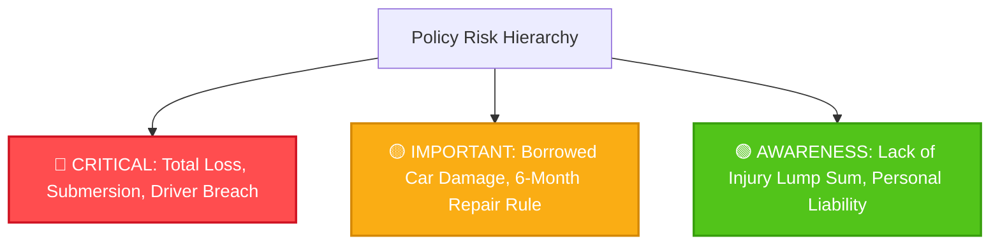

# Auto Insurance Policy Coverage Audit Report
## Forensic Legal Analysis & Coverage Reality Assessment

> **Policyholder & Named Insured:** TARO YAMADA さま (Sample Policyholder)  
> **Underwriting Insurer:** Mitsui Direct General Insurance Co., Ltd. (三井ダイレクト損害保険株式会社)  
> **Official Insurer Portal:** [Mitsui Direct Sompo Official Website](https://www.mitsui-direct.co.jp/) | [Customer My Page (マイページ)](https://www.mitsui-direct.co.jp/customer/)  
> **Policy / Certificate Number:** POL-SAMPLE-202501  
> **Insured Vehicle:** Nissan X-Trail SNT33 (4WD e-4ORCE / e-POWER Series Hybrid)  
> **Initial Registration:** September 4, 2022 (Plate: Shinagawa 300 Sa 1234 / 品川300 さ 1234)  
> **Policy Period:** October 23, 2025 at 4:00 PM – October 23, 2026 at 4:00 PM (1 Year)  
> **Audited Binding Documents:**
> - 📄 **General Policy Booklet (普通保険約款):** [`uploads/policy-booklets/policywording_car_20250401_to_20260331.pdf`](../uploads/policy-booklets/policywording_car_20250401_to_20260331.pdf) (Valid: Apr 1, 2025 – Mar 31, 2026)
> - 📄 **Roadside Assistance Terms (ロードサービス規約):** [`uploads/roadside-terms/roadservice_from_20250401.pdf`](../uploads/roadside-terms/roadservice_from_20250401.pdf) (Valid: Apr 1, 2025 – Present)
> **Audit Date:** September 21, 2026  

---

## Executive Summary

This forensic audit maps your automobile insurance certificate to Mitsui Direct's legally binding policy booklet (*普通保険約款*) and roadside assistance regulations (*ロードサービス規約*), enriched with official guidance from the insurer's portal.

While your policy provides robust liability protection (Unlimited Bodily Injury and Property Damage), **a critical financial vulnerability exists: your contract has NO Vehicle Hull Insurance (車両保険: なし)**. For a sophisticated, ¥4,000,000+ SUV equipped with Nissan’s e-POWER hybrid powertrain, dual electric drive motors, and underfloor lithium-ion battery, any physical damage from collision, flood submersion, typhoon, or hit-and-run is **100% out of pocket**. Furthermore, strict driver qualifications (**Named Insured Only / 本人限定**) completely void all insurance coverage if anyone other than TARO YAMADA operates the vehicle.

---

## Table of Contents
1. [Section 1: Coverage Reality Table with Granular Legal References](#section-1-coverage-reality-table-with-granular-legal-references)
2. [Section 2: The Danger Zone — Critical Uncovered Scenarios](#section-2-the-danger-zone--critical-uncovered-scenarios)
3. [Section 3: Hidden Usable Benefits (Usable Without an Accident)](#section-3-hidden-usable-benefits-usable-without-an-accident)
4. [Section 4: Powertrain-Specific Analysis (Nissan e-POWER / SNT33)](#section-4-powertrain-specific-analysis-nissan-e-power--snt33)
5. [Section 5: Strategic Recommendations & Action Items](#section-5-strategic-recommendations--action-items)
6. [Section 6: Emergency Quick Reference Card](#section-6-emergency-quick-reference-card)

---

## Section 1: Coverage Reality Table with Granular Legal References

| Coverage Item | Contract Limit | Legal Reality & Conditions | ⚠️ Key Gotcha | Exact Policy Reference (PDF / Page / Article) & Official Link |
|---|---|---|---|---|
| **Third-Party Bodily Injury Liability**<br>*(対人賠償保険)* | **Unlimited**<br>(無制限 / per person) | Covers statutory civil liability exceeding Compulsory Automobile Liability Insurance (CALI / 自賠責保険) for injuring/killing third parties. Includes ¥200,000 condolence temporary expense. | **Family Exclusion (第4条第1項)**.<br>Striking or injuring your spouse, parents, or children is **100% excluded (¥0 payout)**. | 📄 `policywording_car_20250401_to_20260331.pdf`<br>📑 **Pages 14–16**<br>⚖️ Chapter 1 (第1章 対人賠償条項) Articles 2, 4(1), 11<br>🌐 [Mitsui Direct: Bodily Injury Guide](https://www.mitsui-direct.co.jp/car/compensation/) |
| **Third-Party Property Damage Liability**<br>*(対物賠償保険)* | **Unlimited**<br>(無制限 / per accident) | Covers statutory liability for destroying third-party property (vehicles, infrastructure, buildings). Legally capped at the **actual cash value (market value)** of damaged items. | **Self/Family Property Exclusion (第4条第1項)**.<br>Crashing into your own garage, gate, fence, or a family-owned car is **strictly excluded (¥0 payout)**. | 📄 `policywording_car_20250401_to_20260331.pdf`<br>📑 **Pages 16–17**<br>⚖️ Chapter 2 (第2章 対物賠償条項) Articles 2, 4(1), 11<br>🌐 [Mitsui Direct: Property Damage Guide](https://www.mitsui-direct.co.jp/car/compensation/) |
| **Excess Property Damage Repair Cost Rider**<br>*(対物超過修理費特約)* | **Active**<br>(Up to ¥500,000) | If the repair cost of the other party's vehicle exceeds its market value, pays your fault-proportionate share of the excess repair costs up to ¥500,000. | **Actual Repair Required Within 6 Months (第3条)**.<br>If the third party scraps or replaces their car, or fails to complete repairs within 6 months, **¥0 is paid**. | 📄 `policywording_car_20250401_to_20260331.pdf`<br>📑 **Pages 32–33**<br>⚖️ Special Provision (1) (対物超過修理費用補償特約) Articles 3, 4, 6<br>🌐 [Mitsui Direct: Excess Repair Cost Rider](https://www.mitsui-direct.co.jp/car/compensation/) |
| **Personal Injury Protection**<br>*(人身傷害保険)* | **¥30,000,000**<br>(In- & out-of-vehicle type) | Compensates actual financial damages (medical expenses, lost wages, pain & suffering) regardless of your fault percentage, up to ¥30M. Covers pedestrian and other vehicle accidents. | **Natural Disaster & Health Exclusions (第3条・第4条)**.<br>Death or injury resulting from earthquake, tsunami, eruption, or sudden illness while driving is **100% excluded**. | 📄 `policywording_car_20250401_to_20260331.pdf`<br>📑 **Pages 17–19, 28–31**<br>⚖️ Chapter 3 (第3章 人身傷害条項) Articles 2, 3(1), 4(1), Schedule<br>🌐 [Mitsui Direct: Personal Injury Guide](https://www.mitsui-direct.co.jp/car/compensation/) |
| **Passenger Injury Rider - Death/Disability**<br>*(搭乗者傷害特約 死亡・後遺障害)* | **¥3,000,000**<br>(Fixed benefit) | Pays a lump-sum ¥3M for death or 4%–100% (¥120k–¥3M) for permanent disability resulting from an accident in the vehicle within **180 days**, stacked on top of Personal Injury Protection. | **No Hospitalization/Outpatient Lump Sum**.<br>The medical injury lump-sum rider (入通院一時金) is **inactive (none)**. Minor injuries and hospital visits yield ¥0 from this rider. | 📄 `policywording_car_20250401_to_20260331.pdf`<br>📑 **Pages 40–41**<br>⚖️ Special Provision (7) (搭乗者傷害危険補償特約) Articles 3, 6, 7<br>🌐 [Mitsui Direct: Passenger Injury Rider](https://www.mitsui-direct.co.jp/car/compensation/) |
| **Vehicle Hull Damage Insurance**<br>*(車両保険)* | ❌ **NONE**<br>(なし / ¥0) | **Zero insurance coverage for physical damage to your Nissan X-Trail**.<br>Collisions, single-car crashes, theft, fire, vandalism, hail, and flood submersion are entirely uninsurable under your current contract. | 🚨 **Severe Financial Exposure!**<br>Total loss of your ¥4M+ e-4ORCE vehicle results in **zero insurance recovery**. You must pay 100% of all repair or replacement costs yourself. | 📄 `policywording_car_20250401_to_20260331.pdf`<br>📑 **Pages 19–20**<br>⚖️ Chapter 4 (第4章 車両条項) Articles 2, 4, 5 (Not opted)<br>🌐 [Mitsui Direct: Vehicle Insurance Guide](https://www.mitsui-direct.co.jp/car/compensation/car/) |
| **Legal Expense / Attorney Fee Rider**<br>*(弁護士費用特約)* | **Active**<br>(¥3,000,000 limit) | Pays attorney fees (up to ¥3M) and legal consultation fees (up to ¥100,000) when pursuing claims against negligent third parties in zero-fault "victim accidents" (もらい事故). | **Prior Written Consent Required (第3条第1項)**.<br>Retaining an attorney or legal counsel without prior approval from Mitsui Direct may lead to denial or reduction of fee reimbursements. | 📄 `policywording_car_20250401_to_20260331.pdf`<br>📑 **Pages 53–56**<br>⚖️ Special Provision (21) (自動車事故弁護士費用等補償特約) Articles 3, 5, 7<br>🌐 [Mitsui Direct: Legal Expense Rider](https://www.mitsui-direct.co.jp/car/compensation/) |
| **Driving Other Cars Rider**<br>*(他車運転特約)* | **Active**<br>(Automatically included) | Treats temporarily borrowed private passenger cars as the insured vehicle under your Bodily Injury, Property Damage, and Personal Injury coverages. | **Borrowed Vehicle Damage Is NOT Covered**!<br>Because your underlying policy has **no Vehicle Hull Insurance**, physical damage to a friend’s borrowed car is **completely uncovered**. | 📄 `policywording_car_20250401_to_20260331.pdf`<br>📑 **Pages 48–49**<br>⚖️ Special Provision (16) (他車運転危険補償特約) Articles 2, 3, 4<br>🌐 [Mitsui Direct: Driving Other Cars Rider](https://www.mitsui-direct.co.jp/car/compensation/) |
| **Driver Scope Special Provision**<br>*(運転者本人限定特約)* | **Named Insured Only**<br>(本人限定) | Restricts driving qualification strictly to TARO YAMADA in exchange for discounted premiums. | 🚨 **Complete Loss of Coverage If Anyone Else Drives**!<br>If a spouse, relative, coworker, or friend drives and causes an accident, **all liability and injury coverage is voided (¥0 payout)**. | 📄 `policywording_car_20250401_to_20260331.pdf`<br>📑 **Page 59**<br>⚖️ Special Provision (25) (運転者本人限定特約)<br>🌐 [Mitsui Direct: Driver Scope Conditions](https://www.mitsui-direct.co.jp/car/compensation/) |
| **Driver Age Restriction**<br>*(運転者年齢条件)* | **Age 26 and Over**<br>(26歳以上補償) | Restricts eligible drivers to persons aged 26 and above. | Fully satisfied (Insured is 31 years old). If modified in the future, drivers under 26 remain uncovered. | 📄 `policywording_car_20250401_to_20260331.pdf`<br>📑 **Page 59**<br>⚖️ Special Provision (26) (運転者年齢限定特約)<br>🌐 [Mitsui Direct: Age Conditions Guide](https://www.mitsui-direct.co.jp/car/compensation/) |

---

## Section 2: The Danger Zone — Critical Uncovered Scenarios



### 🔴 CRITICAL SEVERITY (Catastrophic Financial Loss: ¥1,000,000 to ¥10,000,000+)

1. **Complete Absence of Vehicle Hull Insurance (車両保険なし)**
   - **Binding Citation:** 📄 `policywording_car_20250401_to_20260331.pdf`, **Pages 19–20**, Chapter 4 (第4章 車両条項) Articles 2, 4 & 5.
   - **Real-World Impact:** Nissan X-Trail SNT33 houses an underfloor lithium-ion high-voltage battery and dual e-4ORCE motors.
     - **Typhoon & Heavy Rain Flooding:** Driving through standing water that reaches the floor pan causes immediate electrical total loss. **Insurance payout: ¥0.**
     - **Single-Car Accidents:** Skidding on black ice or wet pavement into a guardrail or utility pole. **Insurance payout: ¥0.**
     - **Parking Lot Hit-and-Run:** Vehicle found crushed with no identifiable perpetrator. **Insurance payout: ¥0.**
   - **Actionable Mitigation:** Consider adding **"Economy Type" (車対車＋限定危険)** vehicle hull coverage via [Mitsui Direct Customer My Page](https://www.mitsui-direct.co.jp/customer/) with a ¥100,000 deductible to protect against floods, vehicle-to-vehicle collisions, and theft.

2. **Breach of the "Named Insured Only" Driver Scope (本人限定特約違反)**
   - **Binding Citation:** 📄 `policywording_car_20250401_to_20260331.pdf`, **Page 59**, Special Provision (25) (運転者本人限定特約).
   - **Real-World Impact:** If you allow a friend, partner, or colleague to drive and an accident occurs:
     - Third-party bodily injury liability: **DENIED (¥0)**
     - Third-party property damage liability: **DENIED (¥0)**
     - Personal injury protection: **DENIED (¥0)**
     The driver and vehicle owner face unlimited personal civil liability.
   - **Actionable Mitigation:** Enforce an absolute rule that **nobody else drives your vehicle**.

3. **Intra-Family Injury and Property Exclusions**
   - **Binding Citation:** 📄 `policywording_car_20250401_to_20260331.pdf`, **Page 14**, Chapter 1 Article 4(1); **Page 16**, Chapter 2 Article 4(1).
   - **Real-World Impact:** If you accidentally back into a family member or crash into your own garage door or a family-owned car, Liability Insurance pays **¥0**.

4. **Earthquake, Volcanic Eruption, and Tsunami Disasters**
   - **Binding Citation:** 📄 `policywording_car_20250401_to_20260331.pdf`, **Page 17**, Chapter 3 Article 4(1)②; **Pages 14 & 16**, Chapters 1 & 2 Article 4(2)②.
   - **Real-World Impact:** Injuries or vehicle destruction triggered by earthquake or tsunami are excluded from coverage.

---

### 🟡 IMPORTANT SEVERITY (Moderate Financial Loss: ¥100,000 to ¥1,000,000)

1. **Driving Other Cars: Zero Hull Damage Protection**
   - **Binding Citation:** 📄 `policywording_car_20250401_to_20260331.pdf`, **Pages 48–49**, Special Provision (16) Article 4.
   - **Real-World Impact:** Damaging a borrowed car leaves you personally liable because your own policy lacks Vehicle Hull coverage.
2. **Excess Property Damage 6-Month Repair Condition**
   - **Binding Citation:** 📄 `policywording_car_20250401_to_20260331.pdf`, **Pages 32–33**, Special Provision (1) Article 3.
   - **Real-World Impact:** If the other driver scraps their vehicle or does not complete repairs within 6 months, the ¥500,000 benefit pays **¥0**.

---

## Section 3: Hidden Usable Benefits (Usable Without an Accident)

### How Do You Know You Are Eligible Under Your Contract?
1. **Automatic Policy Inclusion (*対象契約*):** 📄 `roadservice_from_20250401.pdf`, **Page 1**. Bundled automatically with Mitsui Direct's auto policy (*強くてやさしいクルマの保険*).
2. **Independent of Vehicle Hull Insurance (*「車両保険」のセット有無に関わらず*):** 📄 `roadservice_from_20250401.pdf`, **Page 2, Clause I.3.(1)**. Roadside service is fully active even with **no Vehicle Insurance**.
3. **Passenger Scope (*利用者の対象範囲*):** 📄 `roadservice_from_20250401.pdf`, **Page 2, Clause I.4.(1)**. Covers TARO YAMADA and **all passengers currently in the vehicle**.

---

### 1. 24/7 Complimentary Roadside Assistance
> **Dedicated Dispatch Line:** `0120-258-312` (Toll-free, 24/7/365)  
> 🌐 [Official Mitsui Direct Roadside Service Portal](https://www.mitsui-direct.co.jp/car/roadservice/)

| Benefit / Service | Eligibility & Prerequisite Conditions | What Is Covered | Exact Document Citation |
|---|---|---|---|
| 🚗 **Towing Service**<br>*(レッカーサービス)* | • Immobilized by accident, mechanical breakdown, or electric power depletion (*電欠*).<br>• Fully active **regardless of Vehicle Hull Insurance**.<br>• Excludes multiple tows for the same breakdown cause. | • **Insurer-Designated Repair Shop:** Distance **unlimited (距離無制限)**.<br>• **User-Specified Repair Shop:** Free up to **100 km actual travel distance**.<br>• **電欠 (EV / e-POWER):** Towing to nearest charging spot is distance unlimited.<br>• Specialized winching/extrication covered up to **¥30,000 (tax incl.)**. | 📄 `roadservice_from_20250401.pdf`<br>📑 **Page 6, Clause II.1** |
| 🔋 **Battery Jump-Start**<br>*(バッテリー上がり救援)* | • **1 time per policy period** (1保険期間中1回無料).<br>• Applicable to 12V auxiliary starting battery.<br>*(Cannot recharge high-voltage traction battery on-site; flat traction batteries receive towing).* | Free on-site booster cable connection to re-energize the 12V auxiliary battery and reboot the e-POWER hybrid control unit. Free labor. | 📄 `roadservice_from_20250401.pdf`<br>📑 **Page 7, Clause II.2.②** |
| ⛽ **Emergency Fuel Delivery**<br>*(ガソリン10Lサービス)* | • **1 time per policy period** (1保険期間中1回無料).<br>• Vehicle immobilized due to running out of fuel on expressways or general public roads.<br>• Excluded if stranded at a location where fuel can be procured independently (e.g. inside a highway SA). | Emergency dispatch delivering up to **10 liters of regular gasoline free of charge** (fuel cost and delivery labor 100% covered). | 📄 `roadservice_from_20250401.pdf`<br>📑 **Page 10, Clause II.11** |
| 🛞 **Flat Tire Replacement**<br>*(スペアタイヤ交換)* | • Must carry a usable spare wheel/tire onboard in the vehicle.<br>• *Note:* If vehicle carries only a tire puncture sealant kit rather than a spare wheel, towing is dispatched instead under Clause II.1. | Free on-site labor to unmount punctured tire and install onboard spare wheel/tire. | 📄 `roadservice_from_20250401.pdf`<br>📑 **Page 7, Clause II.2.③** |
| 🔑 **Key Lockout Service**<br>*(キー閉じ込み鍵開け)* | • Standard cylinder key locked inside the cabin or trunk.<br>• Excludes smart key loss, electronic transponder reprogramming, or high-security deadlocks requiring destructive entry. | Free on-site non-destructive unlocking service of standard cylinder door locks. | 📄 `roadservice_from_20250401.pdf`<br>📑 **Page 7, Clause II.2.①** |
| 🕳️ **Ditch Extrication / Wheel Drop**<br>*(落輪引上げ)* | • 1 or 2 wheels dropped into roadside gutter, ditch, or snowbank with vertical drop under 1 meter.<br>• Must be on a recognized road (excludes beaches, riverbeds, or seasonal closed roads). | Winching and pulling recovery back onto roadway covered up to **¥20,000 (tax incl.)**. | 📄 `roadservice_from_20250401.pdf`<br>📑 **Page 7, Clause II.2.④** |
| 🛠️ **On-Site Emergency Quick Repairs**<br>*(現場応急対応)* | • Minor technical or electrical failure resolvable on-site within approximately 30 minutes.<br>• Parts and fluids not included. | Up to 30 minutes of emergency on-site technician labor (bolt tightening, fuse replacement, lamp reconnection) free of charge. | 📄 `roadservice_from_20250401.pdf`<br>📑 **Page 7, Clause II.2.⑤** |

---

### 2. Stranded Travel Protection & Far-From-Home Support

| Benefit | Eligibility & Prerequisite Conditions | What Is Covered | Exact Document Citation |
|---|---|---|---|
| 🚄 **Emergency Return Travel**<br>*(緊急帰宅費用)* | • Vehicle immobilized by accident, breakdown, or power depletion (*電欠*).<br>• **No distance prerequisite** (applies wherever disabled in Japan!). | Pays trains, buses, ferries, scheduled flights, or taxis back home or to your immediate destination up to **¥20,000 (tax incl.) per person** for you and **all onboard passengers**. | 📄 `roadservice_from_20250401.pdf`<br>📑 **Page 8, Clause II.3** |
| 🏨 **Emergency Hotel Accommodation**<br>*(臨時宿泊費用)* | • Returning home same-day is geographically or temporally impossible (e.g. late night).<br>⚠️ **Catch:** Excluded if immobilization is caused solely by electric power depletion (*電欠*). | Reimburses nearest overnight hotel room charges up to **¥10,000 (tax incl.) per person** for you and **all onboard passengers**. | 📄 `roadservice_from_20250401.pdf`<br>📑 **Page 8, Clause II.4** |
| 🚙 **12-Hour Free Rental Car**<br>*(レンタカー12時間サービス)* | **Must meet 2 specific gates:**<br>1. **Distance:** Disabled **≥50 km straight-line distance from home**.<br>2. **Renewal Status:** Must be a **Renewal Contract (*継続契約*)** (2nd consecutive year or more with Mitsui Direct). | Provides up to **12 hours of a free 5-number class rental car** to continue your trip or travel home. | 📄 `roadservice_from_20250401.pdf`<br>📑 **Page 10, Clause II.12** |
| 🚚 **Repaired Vehicle Transport**<br>*(車両搬送費用)* | • Following towing and repair at a distant shop.<br>• Vehicle cannot be driven home directly. | Covers overland transport of your repaired car back to your home up to **¥100,000 (tax incl.)**, OR reimburses **1 person's travel fare up to ¥100,000** to retrieve it. | 📄 `roadservice_from_20250401.pdf`<br>📑 **Page 9, Clause II.5** |

---

### 3. Pre-Accident Legal Consultation Benefit
- **Reference:** 📄 `policywording_car_20250401_to_20260331.pdf`, **Page 56**, Special Provision (21) Article 7(2).
- Up to **¥100,000 per incident for professional legal consultations** prior to litigation.

---

### 4. Mandatory Reimbursement Golden Rules
1. **🚨 Mandatory First Call Rule (事前連絡義務):**
   - **Legal Citation:** 📄 `roadservice_from_20250401.pdf`, **Page 4, Clause I.8.(1)**.
   - You **MUST contact Mitsui Direct's Roadside Center FIRST (`0120-258-312`) before arranging any service**. Independent arrangements without prior call are non-reimbursable.
2. **Itemized Receipts (領収書):** Pay upfront and submit original itemized receipts for full reimbursement.

---

## Section 4: Powertrain-Specific Analysis (Nissan e-POWER / SNT33)

1. **Submersion Risk vs. "No Vehicle Hull Insurance":**
   - Underfloor lithium-ion battery and dual motors face destruction in 30–40 cm standing water.
   - Component replacement costs ¥1,500,000–¥2,500,000.
   - **Current insurance payout: ¥0.**
2. **電欠 (Out-of-Charge) Roadside Rules:**
   - Unlimited distance towing to nearest charging spot (📄 `roadservice_from_20250401.pdf`, Page 6, Clause II.1.②).
   - Hotel accommodation is **excluded for 電欠** under Clause II.4 (Page 8).
   - 12V auxiliary jump-start only; high-voltage battery cannot be charged roadside.

---

## Section 5: Strategic Recommendations & Action Items

1. **Address the Vehicle Hull Coverage Gap:** Log in to [Mitsui Direct Customer My Page](https://www.mitsui-direct.co.jp/customer/) to evaluate adding "Economy Type" hull coverage with a ¥100,000 deductible.
2. **Enforce Driver Scope Discipline:** Under "Named Insured Only" (本人限定), never let friends or family drive.
3. **Save Emergency Dispatch Line:** Store `0120-258-312` in your mobile phone.

---

## Section 6: Emergency Quick Reference Card

```
╔══════════════════════════════════════════════════════════════════════════════════╗
║                     EMERGENCY AUTO INSURANCE QUICK CARD                          ║
╠══════════════════════════════════════════════════════════════════════════════════╣
║  Policyholder: TARO YAMADA さま      Policy Number: POL-SAMPLE-202501            ║
║  Vehicle: Nissan X-Trail SNT33 (AWD) Registration: 品川300 さ 1234               ║
║  Policy Period: 2025-10-23 to 2026-10-23 (Expires 4:00 PM)                      ║
╠══════════════════════════════════════════════════════════════════════════════════╣
║  🚨 24/7 ROAD SERVICE HOTLINE:  0120-258-312 (Toll-Free)                         ║
║  🚨 24/7 ACCIDENT REPORT LINE:  0120-258-312 (Toll-Free)                         ║
║  🌐 Web Accident Reporting:     https://www.mitsui-direct.co.jp/car/accident/    ║
║  🌐 Customer My Page:           https://www.mitsui-direct.co.jp/customer/        ║
╠══════════════════════════════════════════════════════════════════════════════════╣
║  KEY LIMITS AT A GLANCE:                                                         ║
║  • Bodily Injury (対人):       UNLIMITED                                         ║
║  • Property Damage (対物):     UNLIMITED                                         ║
║  • Personal Injury (人身傷害): ¥30,000,000                                       ║
║  • Vehicle Hull (車両保険):    ❌ NONE (¥0) — Self-Pay All Physical Damage        ║
║  • Towing:                     Unlimited (Designated) / 100 km (Own Choice)      ║
║  • Return Travel:              ¥20,000 / person (All Passengers)                 ║
║  • Hotel Stay:                 ¥10,000 / person (All Passengers)                 ║
╠══════════════════════════════════════════════════════════════════════════════════╣
║  CRITICAL RULES:                                                                 ║
║  1. CALL 0120-258-312 FIRST before arranging any towing, hotel, or taxi!         ║
║  2. NO ONE ELSE MAY DRIVE (本人限定). Coverage is voided if another drives.     ║
║  3. Retain all original itemized receipts (領収書) for travel/hotel claims.      ║
╚══════════════════════════════════════════════════════════════════════════════════╝
```
